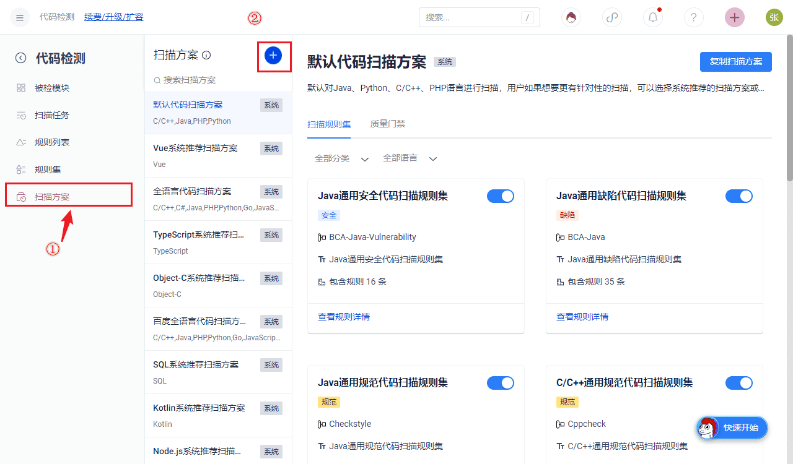
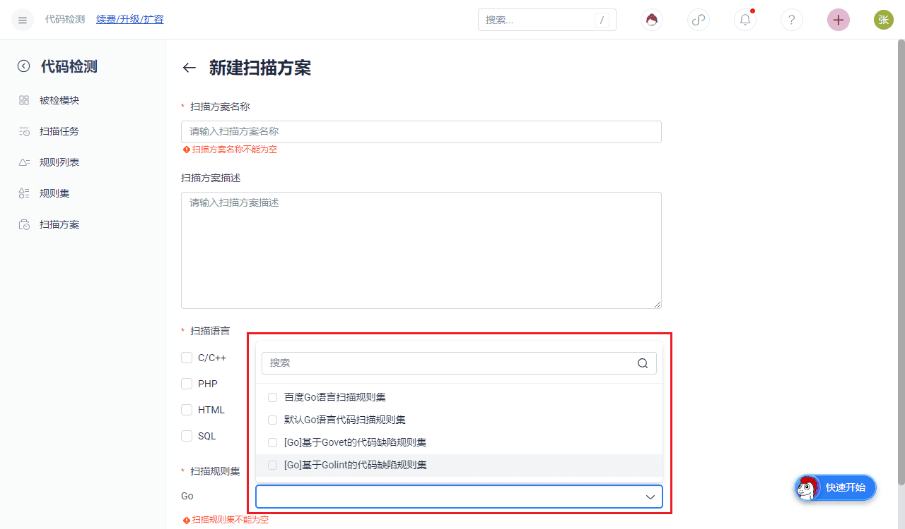
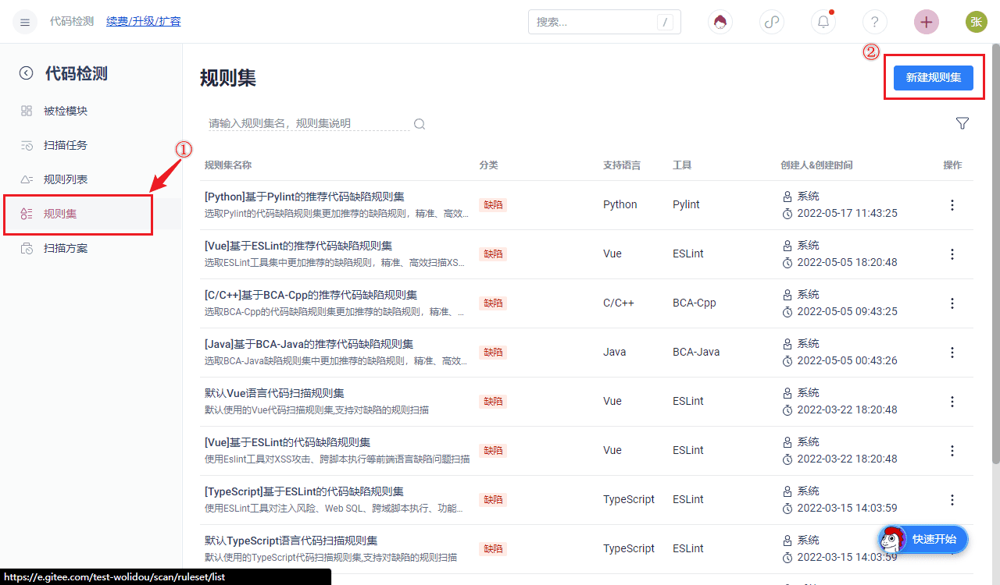
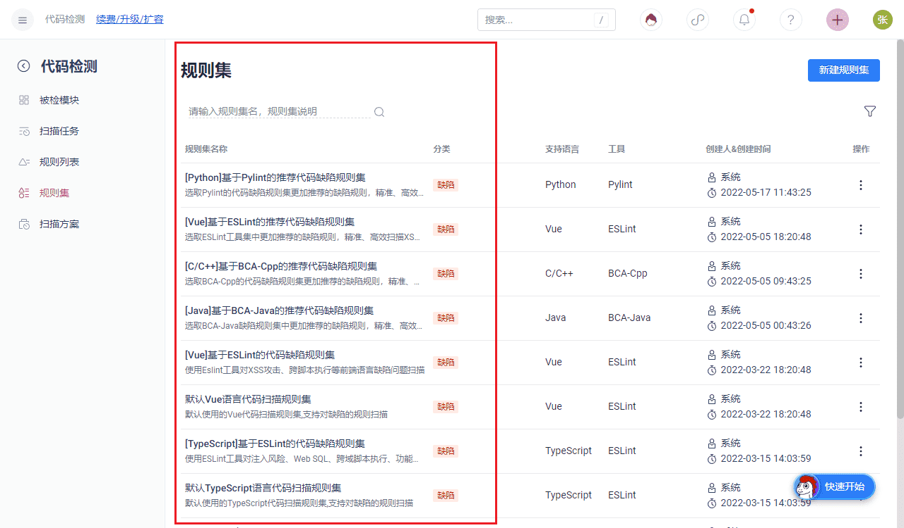

Note: The system provides built-in language scanning schemes and rule sets for users to choose from and also supports customization.

# Customize scanning scheme

Enterprise administrators enter the Scan sub-product menu, click to enter the scan solution navigation, and click on the right to customize the scan solution.

Scan scheme associates rule sets, so the created scan scheme supports a collection of rule sets for different languages. A unified scan scheme can be created for internal use within the enterprise.

# Custom Rule Set

Enterprise administrators enter the Scan sub-product menu, click on the rule set navigation, and click on the right to create a rule set:

A rule set can be associated with different rules under the same language and tool