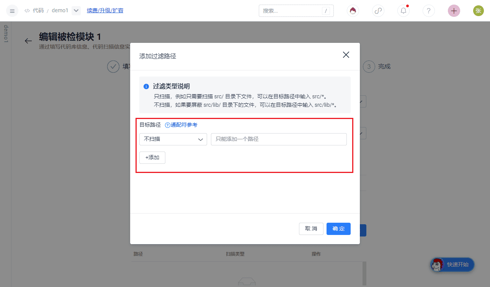

## Filter Path Settings

When creating or editing a module to be checked, you can set path filtering, and support regular expression matching:



Wildcard reference format:

- Please provide a relative path (relative to the root of the codebase) that matches the file

- Use Unix wildcard format, as shown below:

code root directory
|-src
|-test
|-main_test.py
|-input_test.py
|-main.py
|-test
|-param_test.py
Match the src/test directory: src/test/*
Match the test directory under the root directory: test/*
Match all files with the suffix _test.py: *_test.py
```

- After modification, the next scan will take effect. You need to start a full scan to handle historical stock issues