## Full Scan

- Note: Manual scanning is a full scan, and PR or code submission triggers a incremental scan mode.

1. Confirm if the corresponding module has been created in GiteeScan.

- Click on Repository Settings if no modules to be checked have been created:
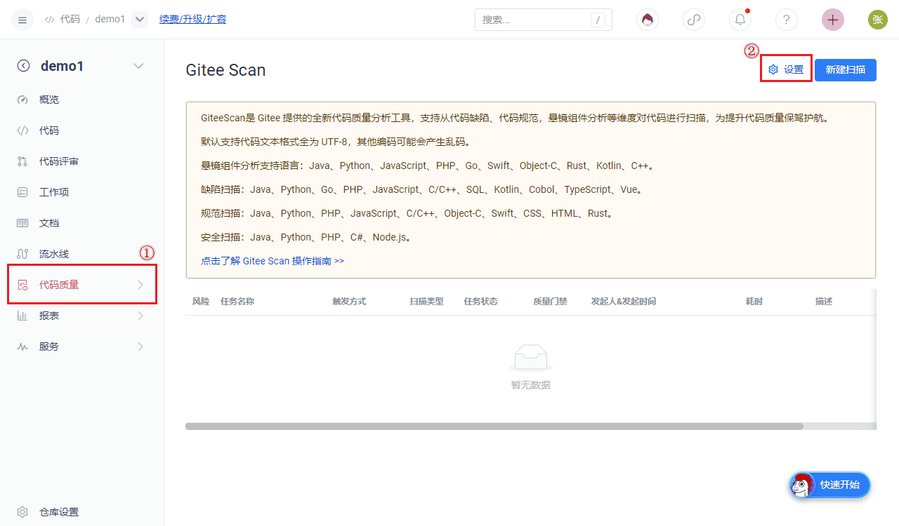
The repository settings can be redirected to the Scan module creation page. The default code repository is the current repository and cannot be changed. Enter and set the relevant content to create the Scan module.
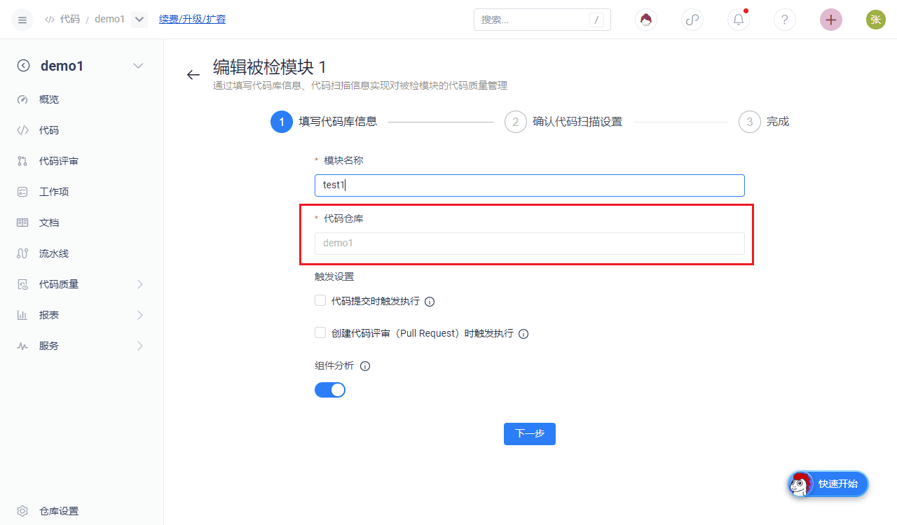

- Enterprise administrators can also click on the code navigation to enter the Gitee Scan sub-product menu:
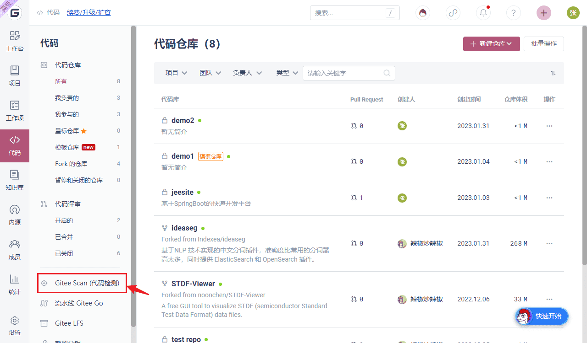
In the scan sub-product menu, click on the module to be checked, and click create to select the corresponding repository to create the corresponding module.
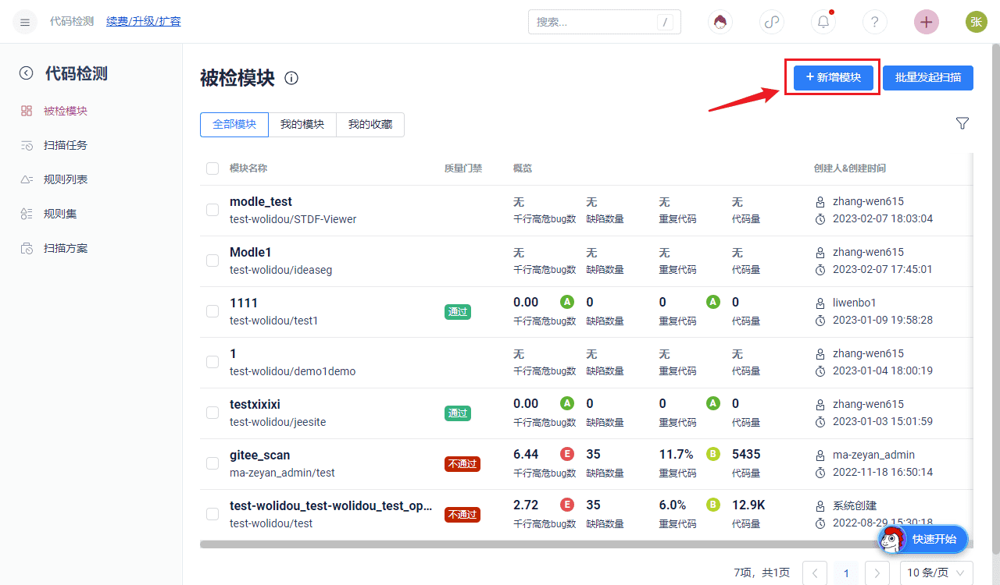
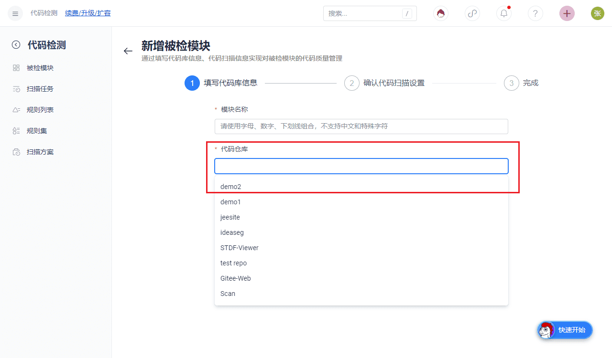

2. After the creation of the module to be tested, how to initiate a full scan

- Click on New Scan in the Repository:
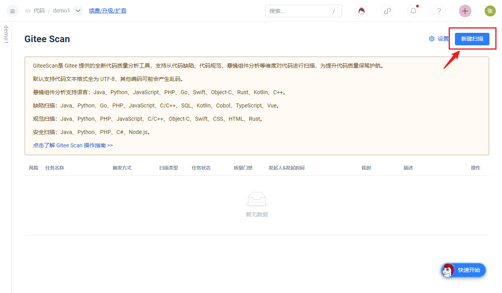

- Scan sub-product menu, select the module to be checked, click the turtle to initiate the scan:
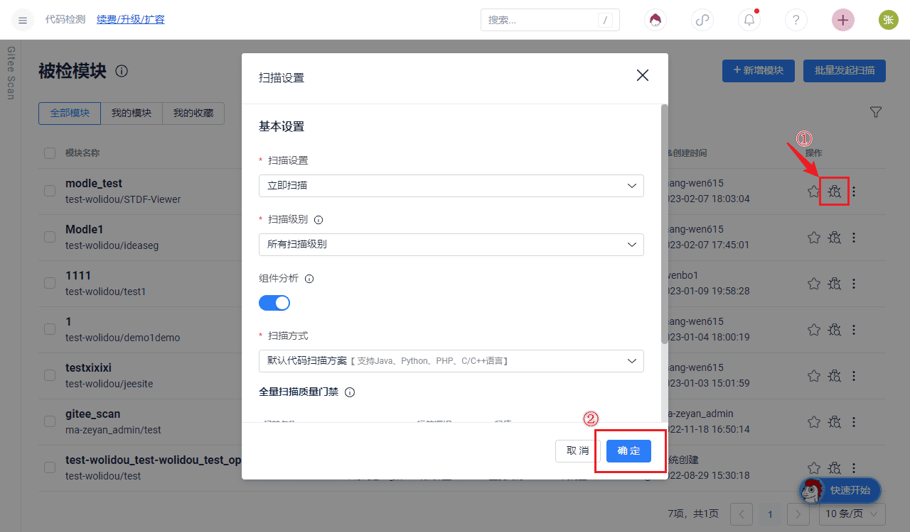

Incremental Scanning

Refer to full scan for steps to create a module to be inspected

- Code submission triggers scanning, select code submission as the triggering method for creating the module to be checked:
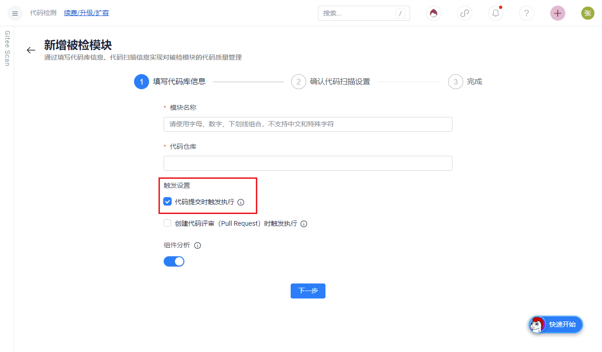

Creation completed, at this time, submitting code to the corresponding repository will trigger code scanning

- Triggered when creating a code review (Pull Request), select create code review trigger for the module being checked:
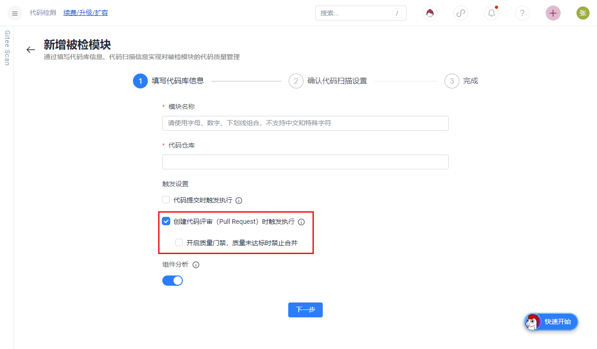

Creation completed, at this time, creating a PR in the corresponding repository will trigger code scanning

## CVE Vulnerabilities and License Compliance Analysis

Note: The current version only supports full scanning for CVE vulnerabilities and license compliance analysis.
Reference step 2.1 for creating the test module

- CVE and license compliance analysis settings:
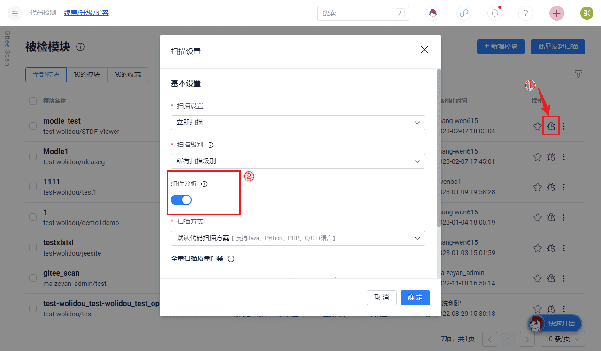
By selecting the module to be inspected on the Scan sub-product page and clicking on the turtle, you can initiate a manual scan. Enable the component analysis switch to perform CVE vulnerability scanning and license compliance analysis.
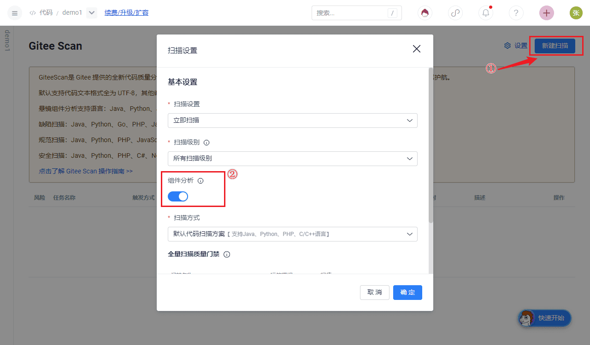
Create a new scan under the repository and enable the component analysis switch to perform CVE vulnerability scanning and license compliance analysis.