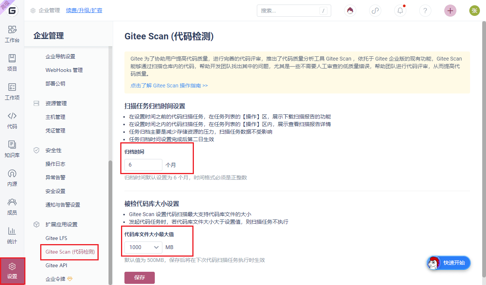

В Gitee пользователи могут распределять ресурсы, устанавливая время архивации задач и размер репозитория проверенного кода

Включение этой функции означает, что пользователи могут инициировать полное сканирование любой ветки репозитория и инкрементное сканирование вновь добавленных запросов на слияние на предприятии.