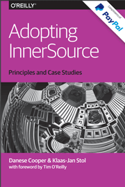

**Organization introduction**

InnerSource is the use of open-source software development best practices and the establishment of a culture similar to open-source within an organization. The organization may still develop proprietary software but opens it up internally.

Benefits of adopting open source

In addition to the quality benefits of open source projects, there are the following benefits:

**Develop more effectively and efficiently**

1. Faster time to market
2. Reduced development costs

Overcome organizational unit boundaries (break down departmental walls)

1. Cost and risk sharing among organizational units
2. Cross-Organizational Unit Boundary Collaboration
3. Application-level information exchange

More successful reuse

1. Can provide capabilities that individual components cannot
2. Reusability and independence between consumers and providers
3. Easier for component providers

Better software products

1. Improved code quality
2. More innovative development

**More flexible use of developers**

1. Simplify deployment for developers
2. Unrelated developers collaborate with each other

Enhanced knowledge management

1. Community Learning
2. Openness and usability of knowledge

**Employees are more motivated**

**Internal source book (PDF download)**
 

PPT sharing (Baidu): [Internal Open Source - WHAT, WHY, HOW](https://gitee.ru/OSCYuanChuangHui/2018_lecturer_ppt/raw/master/2019.12.15%20%E6%B7%B1%E5%9C%B3%E5%B9%B4%E7%BB%88%E7%9B%9B%E5%85%B8/%E5%BC%80%E6%BA%90%E6%B2%BB%E7%90%86/3.%20%E5%86%85%E9%83%A8%E5%BC%80%E6%BA%90%E7%9A%84%20WHAT%20:%20WHY%20:%20HOW%E2%80%94%E2%80%94%E8%B0%AD%E4%B8%AD%E6%84%8F.pdf)

**How does Gitee support enterprise internal sources**

Gitee Enterprise Edition provides direct support for the internal open source governance of enterprises. In Gitee Enterprise Edition, you can centrally manage all external and internal open source projects of the enterprise in the 'Insource' channel. The 'Insource' channel aggregates all information about enterprise open source, including community participation, contributions, evaluations, and more. The technical leader of the enterprise can have a clear understanding of the achievements in the open source field.

To learn more about Gitee's support for enterprise inner-source governance, please read [Gitee Best Practices for Enterprise Inner-Source](https://gitee.ru/InnerSource/gitee-innersource-best-practices).

Go to [Activate Gitee Enterprise Edition](https://gitee.ru/enterprises/new?from=innersource) immediately to experience Gitee's enterprise source governance capabilities.

**Other Internal Source Articles**

- [Inner Source in Platform-Based Product Engineering](https://gitee.ru/InnerSource/definition_of_innersource/raw/master/InnerSourceinPlatform-BasedProductEngineeringIEEETSE.pdf)

- [Inner Source—Adopting Open Source Development Practices in Organizations](https://gitee.ru/link?target=https%3A%2F%2Fwww.infoq.com%2Farticles%2Finner-source-open-source-development-practices%2F)

- [InnerSource with GitLab](https://gitee.ru/link?target=https%3A%2F%2Fabout.gitlab.com%2Fsolutions%2Finnersource%2F)

- [Why You Need to Care About Inner Sourcing](https://gitee.ru/link?target=https%3A%2F%2Fwww.laserfiche.com%2Fecmblog%2Fwhy-you-need-to-care-about-inner-sourcing%2F)

- [InnerSourcing: the development model of the future?](https://gitee.ru/link?target=https%3A%2F%2Fblog.bitergia.com%2F2016%2F07%2F26%2Finnersourcing-the-development-model-of-the-future%2F)

- [Innersource: How to leverage open source in the enterprise](https://gitee.ru/link?target=https%3A%2F%2Fopensource.com%2Farticle%2F17%2F9%2Finnersource)

- [Microsoft is going all-in on 'Inner Source'](https://gitee.ru/link?target=https%3A%2F%2Fwww.zdnet.com%2Farticle%2Fmicrosoft-is-going-all-in-on-inner-source%2F)

- [Salesforce Engineering: Inner Sourcing: What’s this?](https://gitee.ru/link?target=https%3A%2F%2Fengineering.salesforce.com%2Finner-sourcing-whats-this-ef2220ae59ec)

- [BOSCH: Know how Open and Inner Source](https://gitee.ru/link?target=https%3A%2F%2Fwww.bosch.com%2Fresearch%2Fknow-how%2Fopen-and-inner-source%2F)

- [Adobe: Open Development vs. Inner Source](https://gitee.ru/link?target=https%3A%2F%2Fmedium.com%2Fadobetech%2Fopen-development-vs-inner-source-fdccf573a242)

- [ACM: Inner Source Definition, Benefits, and Challenges](https://gitee.ru/link?target=https%3A%2F%2Fdl.acm.org%2Fdoi%2F10.1145%2F2856821)

- [Why open source may trump inner source for internal collaboration](https://gitee.ru/link?target=https%3A%2F%2Fwww.techrepublic.com%2Farticle%2Fwhy-open-source-may-trump-inner-source-for-internal-collaboration%2F)

- [Innersource: A Guide to the What, Why, and How](https://gitee.ru/link?target=https%3A%2F%2Fwww.jonobacon.com%2F2017%2F06%2F25%2Finnersource-guide%2F)

- [IEEE: Inner Source--Adopting Open Source Development Practices in Organizations: A Tutorial](https://gitee.ru/link?target=https%3A%2F%2Fieeexplore.ieee.org%2Fdocument%2F6809709)