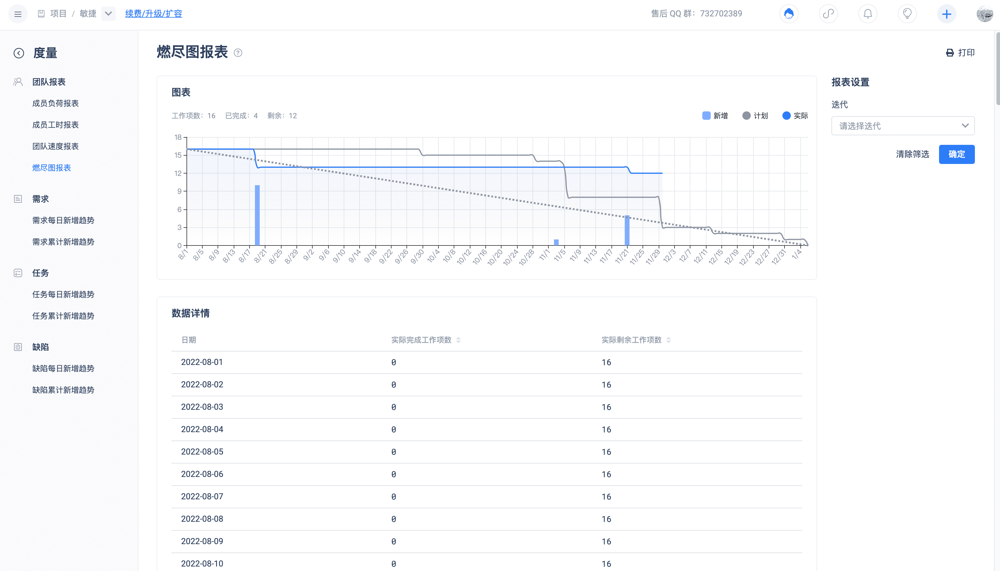

Track the remaining work during the iteration period in the burn-down chart, compare it with the ideal line to predict whether the iteration can complete the goal on time, in order to make corresponding adjustments in a timely manner.
