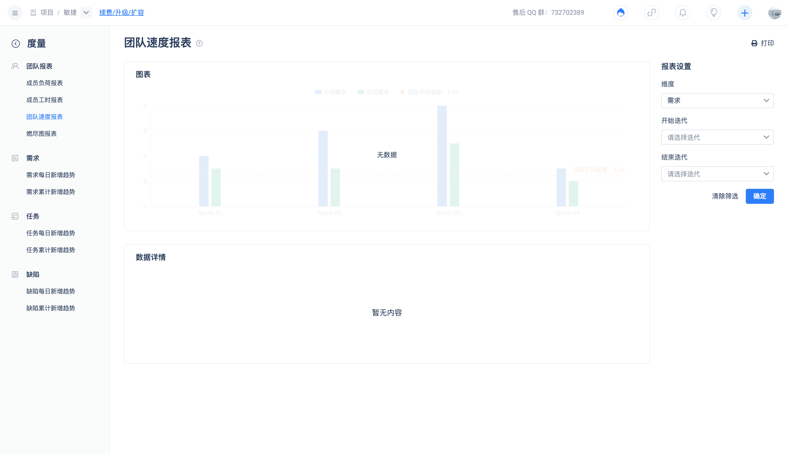

Optimize team work arrangements by comparing historical completed iteration plans and completed work in the team velocity report. Predict the work that can be completed in the upcoming iteration. The selected statistical iteration range is the average value of completed work items within a single iteration, which is the average velocity.
