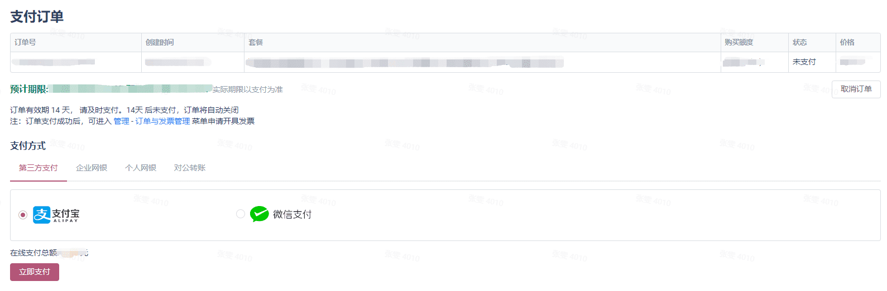

If you already have a corporate account and want to upgrade to a paid version (Enterprise Basic Edition or above).

1. Log in to your account, select 'Mine', and find the corresponding enterprise that needs to be upgraded and click on it.

2. In the enterprise version interface, click on 'Upgrade to paid version'

3. On the upgrade/renewal page, select the desired enterprise package type, number of users, and number of years to purchase. Check and agree to the "Gitee Enterprise Service Terms", then click "Submit Order" to go to the payment page.

Note: The discount code here is only available for new Gitee registered users or during Gitee online promotion activities, and the quantity is limited.

4. Choose the payment method according to your actual payment situation on the payment page.

When making offline public transfers, please make the transfer according to the account information shown in the figure below (based on the account information displayed on this webpage). After completing the transfer, please upload the bank's electronic receipt for the staff to check in a timely manner. Lastly, there are instructions on the page regarding issuing invoices for public transfers, please be aware.

