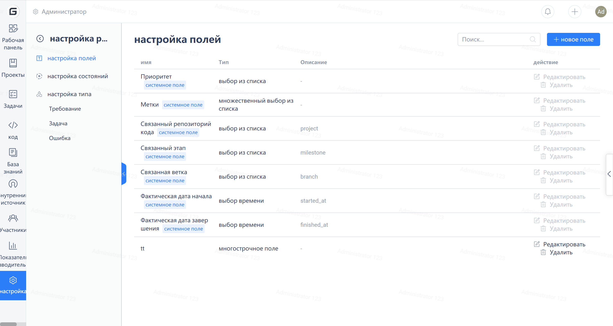
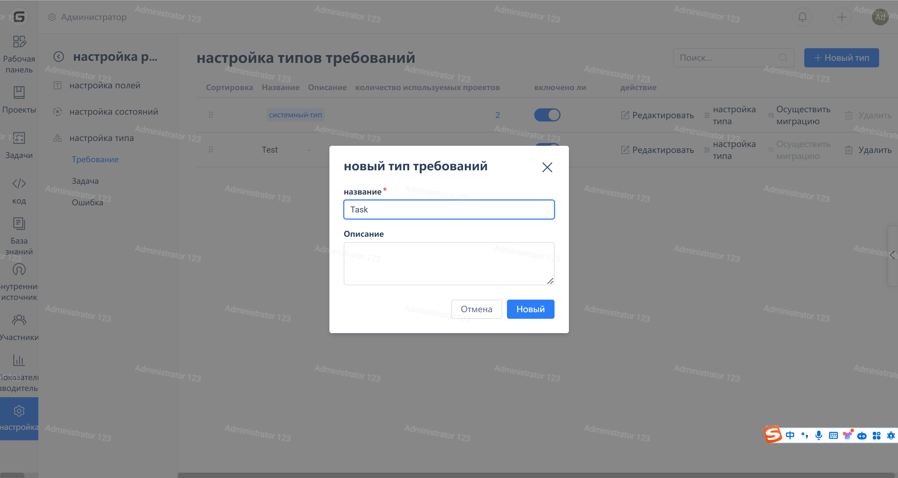

Чтобы создать новый тип задачи/отредактировать существующие типы задач, войдите в учетную запись владельца предприятия и нажмите на "Управление" - "Управление типами задач и статусами", как показано на рисунке ниже:

Чтобы создать новый статус задачи/отредактировать существующий статус задачи, перейдите на вкладку "Статус задачи"

