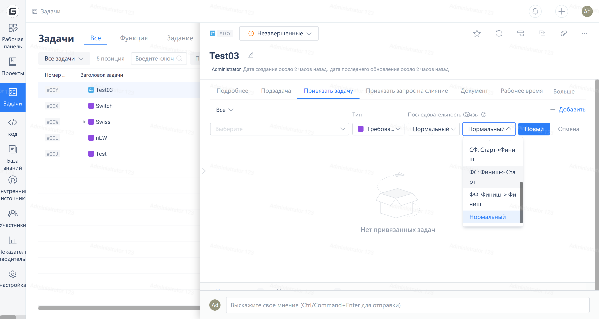

When managing tasks with Gitee Enterprise Edition in daily use, whenever task association is required, you can choose the 'order' and 'relationship' between tasks:

In fact, the concept of leading graph method is applied here

Precedence Diagramming Method (PDM) is a commonly used method for describing project schedule network diagrams, also known as activity-on-node (AON).

In the example below, rectangles represent nodes, representing project tasks, and arrows connecting these nodes represent dependencies between tasks.

PDM has 4 types of dependency relationships as follows (Pre: represents predecessor task, Post: represents successor task):

-(Finish before)-(Start after) (FS type): Completion of the predecessor task leads to the start of the successor task.

-(Finish before)-(Finish after) (FF type): Completion of the predecessor task leads to the completion of the successor task.

Start-Start (SS type): The start of the predecessor task leads to the start of the successor task

Start-Finish (SF type): The start of the predecessor task leads to the finish of the successor task

Currently, Gitee Enterprise does not support another task starting automatically after one task is completed, so project managers need to manually modify the status of tasks when applying them.