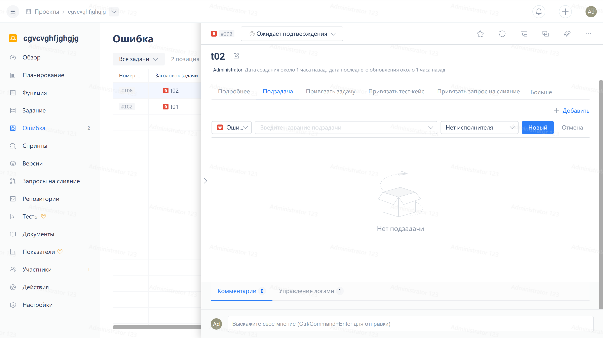
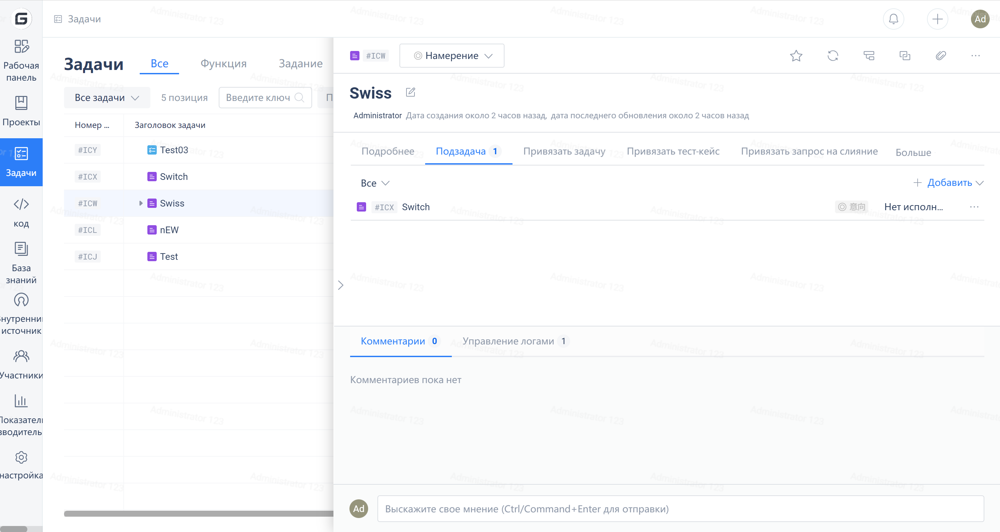
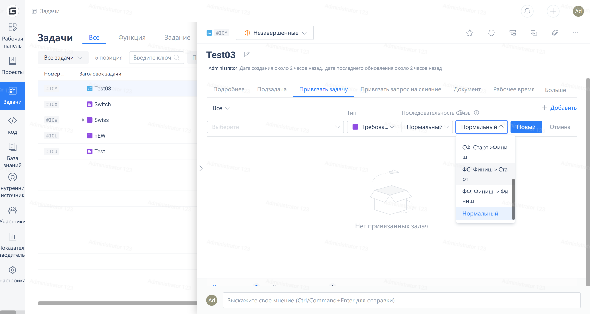

---
{"title"=>"Task Splitting and Association"}
authors:
  - name: No Mo
    url: https://gitee.ru/normalcoder
origin-url: https://gitee.ru/help/articles/4218
---

## Task Decomposition

The product team provides the tasks that need to be developed one or two weeks in advance. These tasks will be discussed within the technical group for half a day, breaking down the product tasks into sub-tasks (independent minimal requirements). At the same time, the estimated completion time and task priority are set for each sub-task. Then, each sub-task is assigned to individuals (with responsibilities). As shown in the diagram below, the task function module in Gitee clearly shows how many sub-tasks the entire requirement has been divided into, which helps with overall project control.

Subtasks:

## Associated Task

