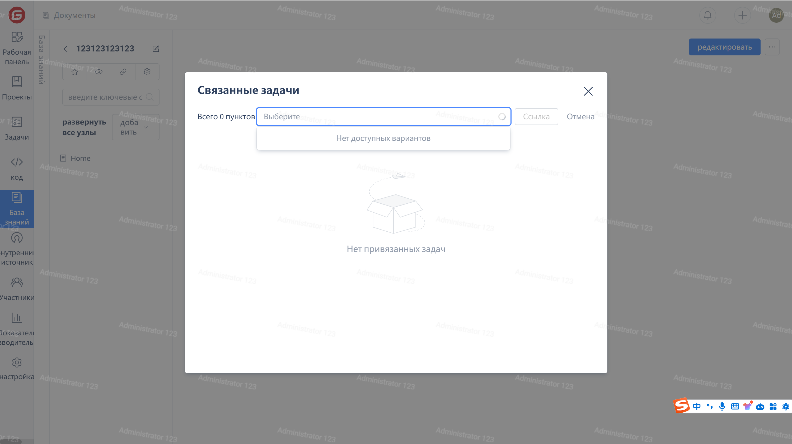
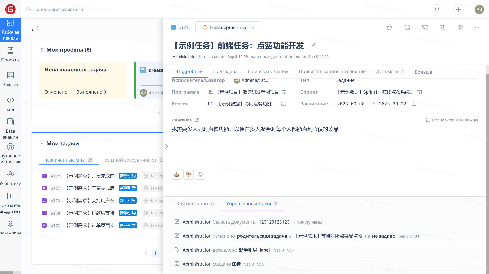

1. Нажмите на иконку для привязки рабочих элементов на странице составления документа;
2. Во всплывающем окне отобразится список рабочих элементов, привязанных к текущему документу. Во всплывающем окне нажмите "Привязать рабочие элементы";
3. Выберите рабочий элемент, который нужно привязать, и нажмите "Привязать" для завершенияи операции привязки.

4. После успешного завершения привязки вы можете просмотреть привязанные документы в разделе "Сведения о рабочем элементе".
