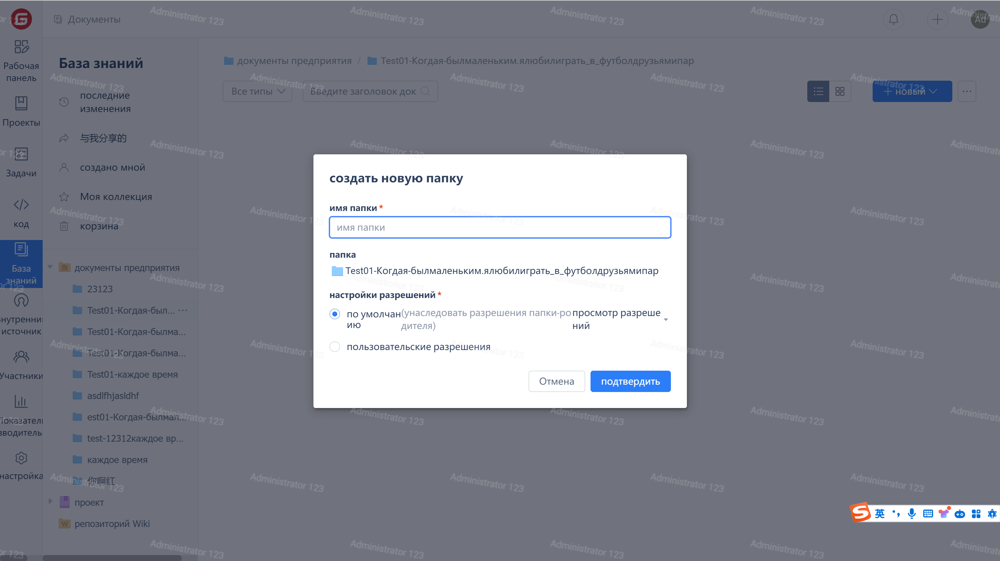
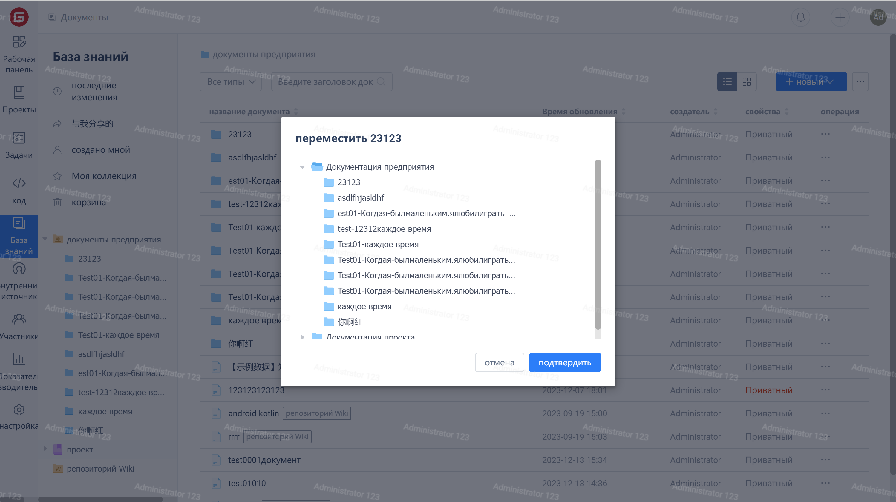

### Create a Document

1. From the right navigation, click on 'Documents' to enter the document page, then click on the 'New Document' button.

2. Fill in the document information in the pop-up window and click the "OK" button to create a new document.

### Document Management

Click on the action bar of the document list to perform actions such as 'Pin', 'Add to Favorites', 'View Details', 'Rename', 'Set Permissions', 'Move', 'Delete' on the document.

### Document Migration

1. After performing a 'Move' operation on a document, select the destination in the pop-up window and click the 'OK' button to move the document.
