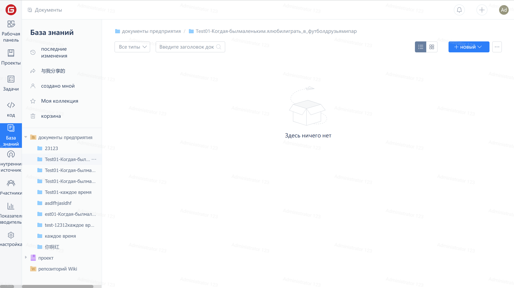
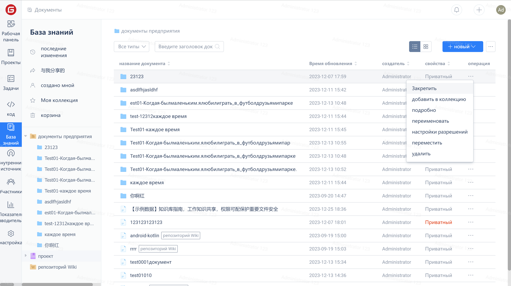

### Создание документа

1. Для перехода на страницу документа нажмите "Документы" в правой части навигационного меню, затем нажмите на кнопку "Новый документ".

2. Чтобы создать новый документ, заполните информацию о документе во всплывающем окне и нажмите кнопку "OK".

### Управление документами

Для выполнения над документом таких действий, как "Закрепить", "Добавить в избранное", "Просмотреть подробности", "Переименовать", "Установить разрешения", "Переместить", "Удалить" нажмите на панель действий в списке документов.

### Миграция документов

1. Для перемещения документа выберите во всплывающем окне папку назначения и нажмите кнопку "OK".
