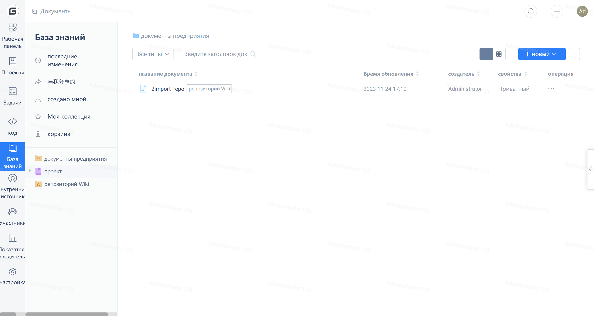
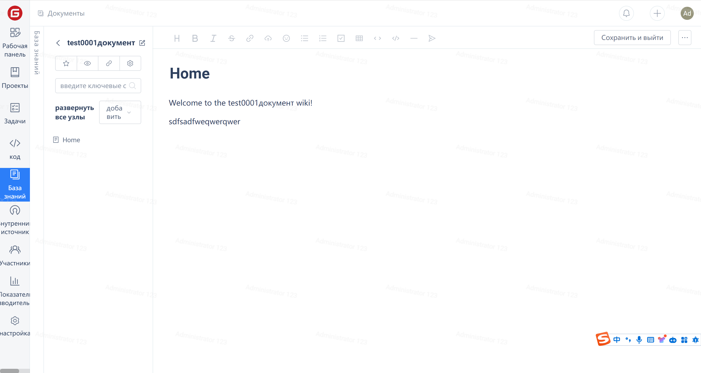
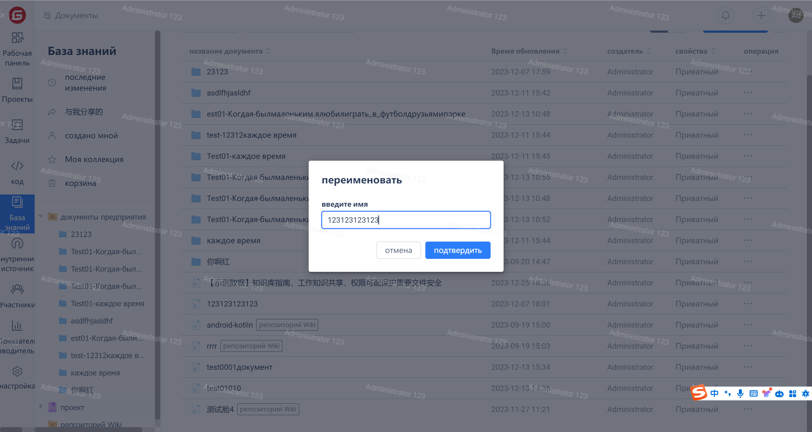
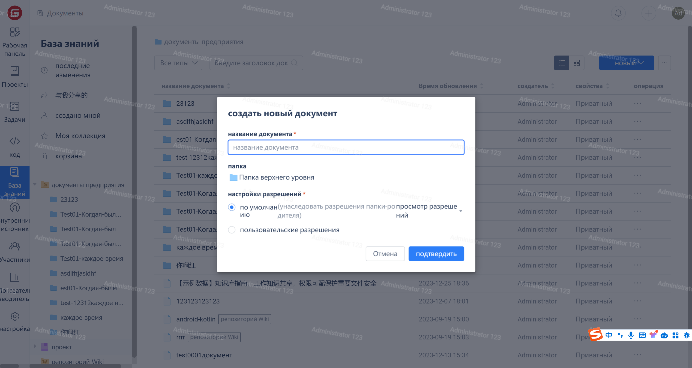

### Редактирование документов

1.  Для перехода на страницу редактирования документов нажмите на любой документ.

2. Для редактирования документа нажмите кнопку "Редактировать".

### Переименование документов

1. Чтобы переименовать документ, нажмите на значок "Редактировать".

### Управление страницами и директориями

1.  Для добавления страниц и директорий нажмите кнопку "Добавить".
