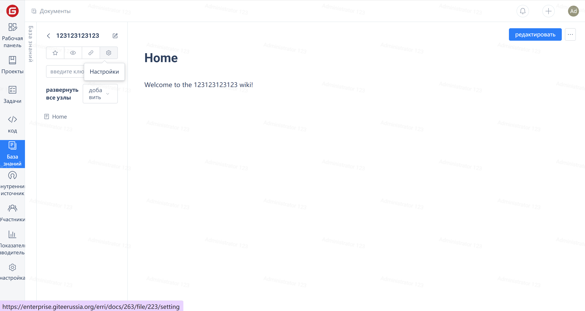
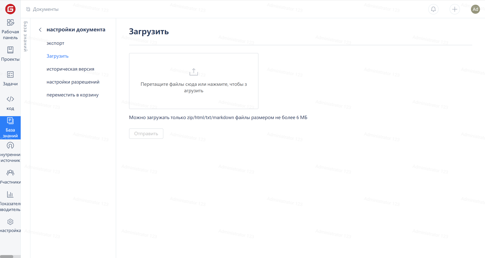
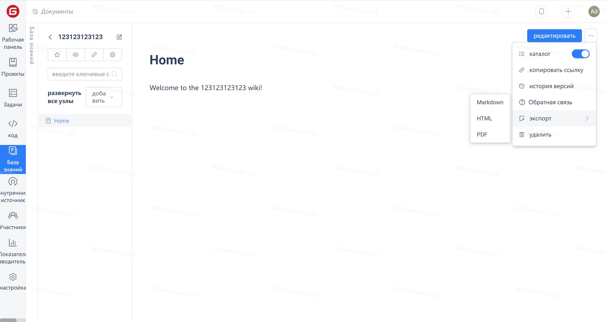

### Document Import

1. Click the "Settings" button on the document page to enter the document settings page;

2. Click on the `Upload` option in the left menu bar to upload zip/html/txt/markdown files for document importation.

### Document Export

1. Click the "Export" button in the upper right corner of the document page to export the document in different formats.
