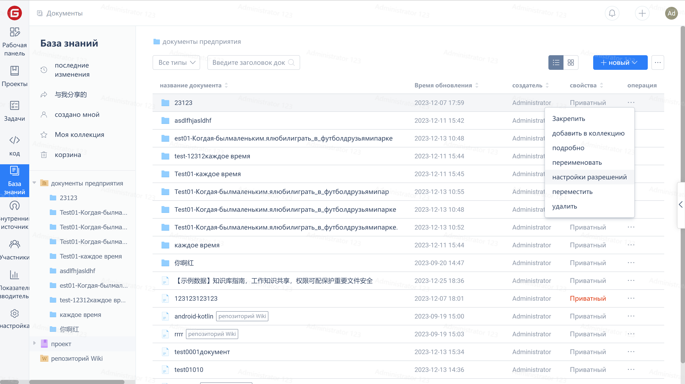
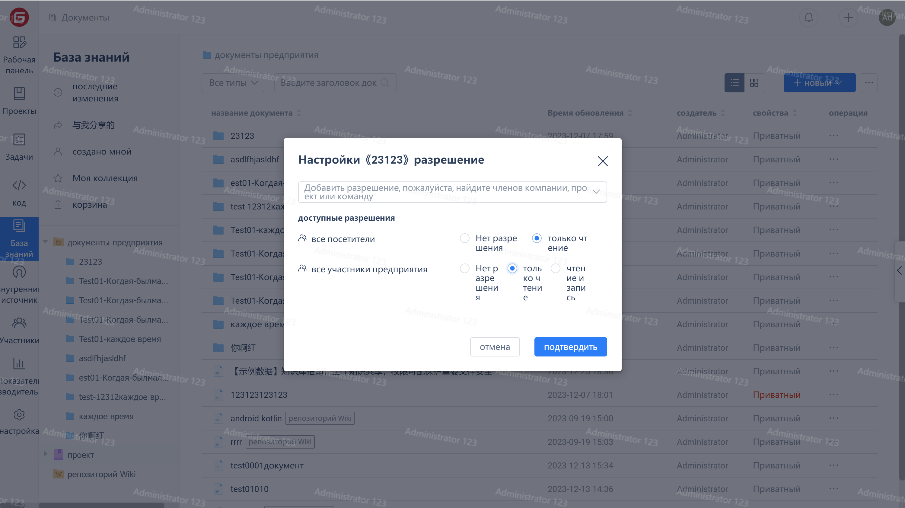

Чтобы помочь менеджерам защитить интеллектуальную собственность и снизить риск утечки кода, вы можете самостоятельно настраивать права доступа участников на основе ролей, папок и документов: "Нет доступа", "Только чтение", "Чтение и запись".

