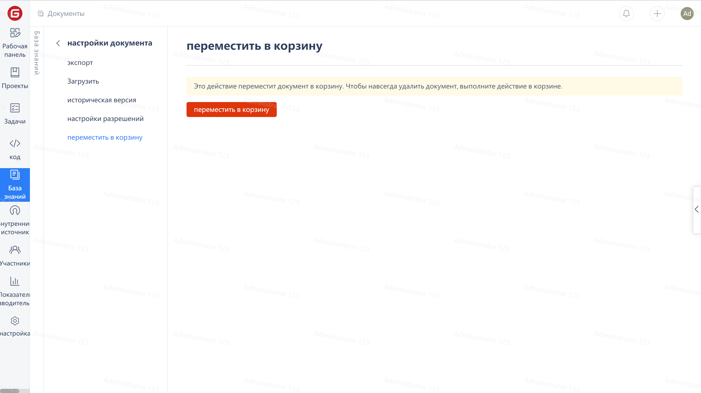

Настройки документов

1. Для входа на страницу "Настройки документов" нажмите на иконку "Настройки" на странице документа.

Исторические версии

1. Для просмотра истории версий документа нажмите на "История версий" в меню слева.

Перемещение в корзину

1. Нажмите "Переместить в корзину" в меню слева;
2. Для перемещения документа в корзину нажмите "Переместить в корзину".
