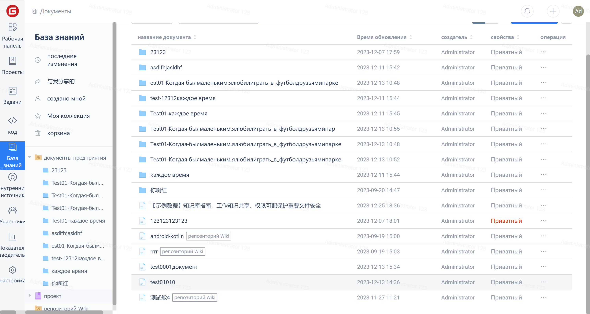

1. Проверьте настройки разрешений для документа и настройте видимость документа;

2. Когда "всем посетителям" предоставлены права на "чтение", список документов будет отображаться как "видимый для посетителей";

3. Нажмите на значок предварительного просмотра в разделе "Сведения о документе"

4. Нажмите на значок "Скопировать ссылку " в правом верхнем углу, чтобы открыть совместный доступ к документу.
