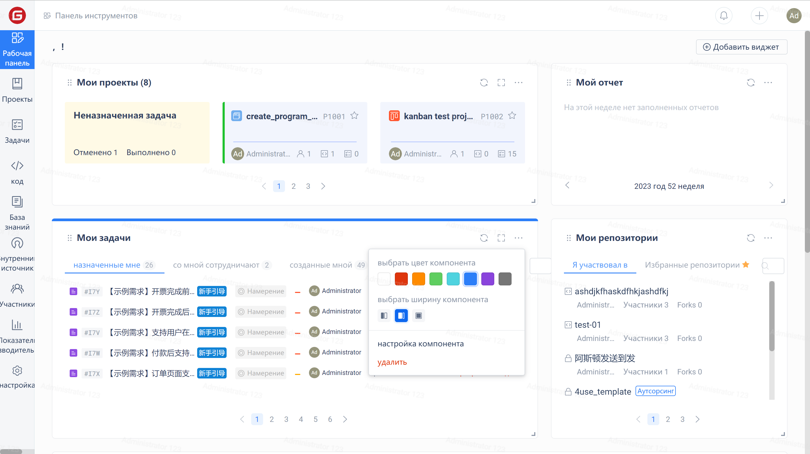
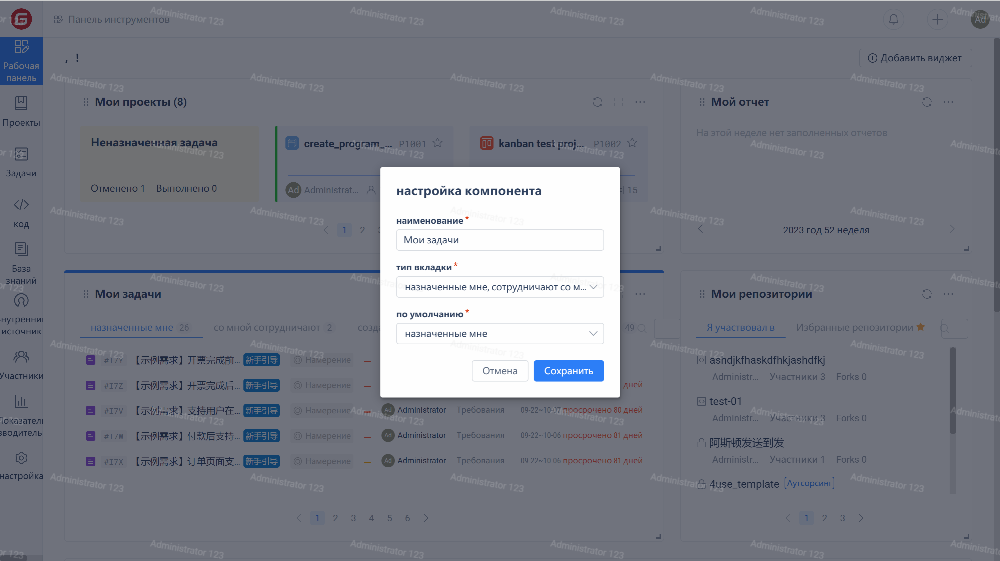

Click on the '...' in the upper right corner of the component card to adjust the color and width of the component in the menu.

Clicking the "Configure Component" option in the menu can further configure the component. The configurable content varies depending on the component type. Taking the Work Item component as an example, it supports configuring the name, tab type, and default tab.

