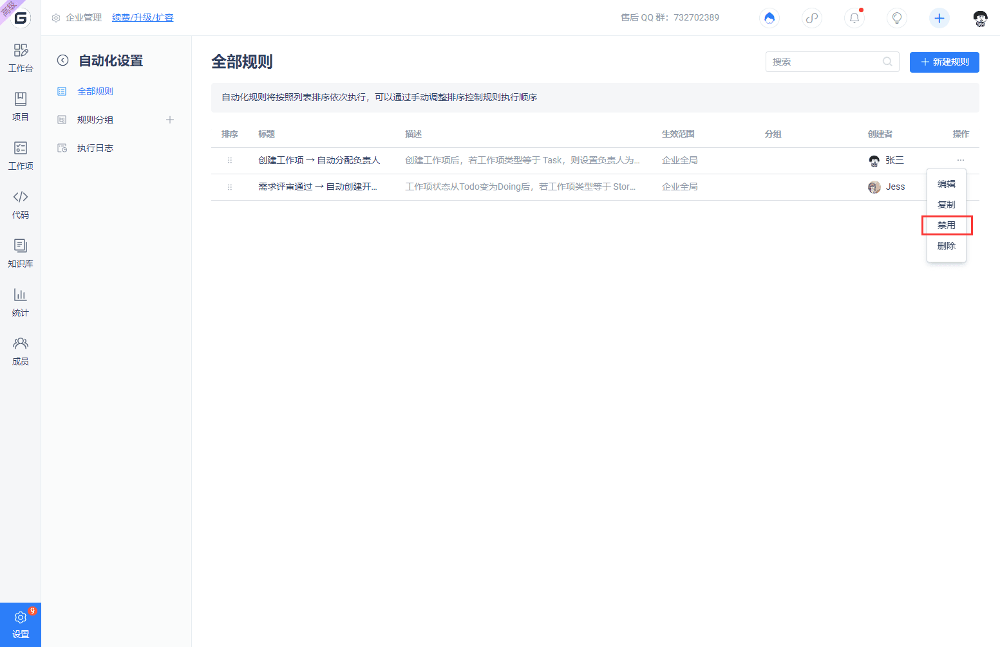

Using automation features can convert some work-related operations to be automatically executed by the system, saving manpower operation costs.

You can access the Automation feature by clicking on "Management" -> "Automation" in the enterprise navigation menu.

## Create Automation Rule

On the 'All Rules' page, click the 'New Rule' button in the upper right corner, and a window will be displayed:

This window provides some preset common templates. Moving the mouse pointer over the template card will display two buttons: "Preview Template" and "Use Template". Clicking the "Preview Template" button will show the detailed configuration of this rule.

Click the "Use Template" button to enter the new page for creating automation rules, and the page content will be pre-filled with the template content.

After configuring the rules, click the "New" button in the upper right corner.

## Disable Automation Rule

Click on the '...' operation menu on the right side of the rule and select 'Disable' to disable this rule. After disabling, the rule will no longer be executed.

View the execution log of automation rules

Click on "Execution Log" in the left menu to enter the execution log page, which displays the execution information of all automation rules.

Click on the automation rule in the list to view detailed logs.

In work items affected by automation rules, you can also open the automation rule execution log by clicking on the `[Automation]` tag in the operation log.

