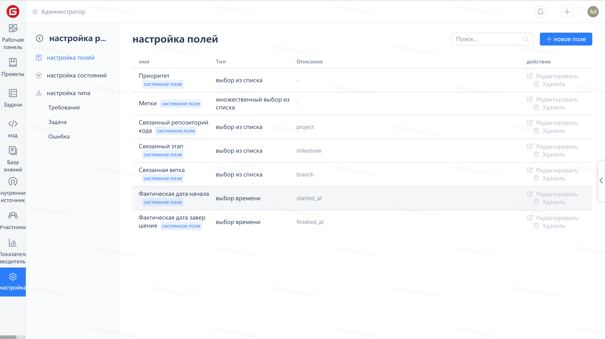
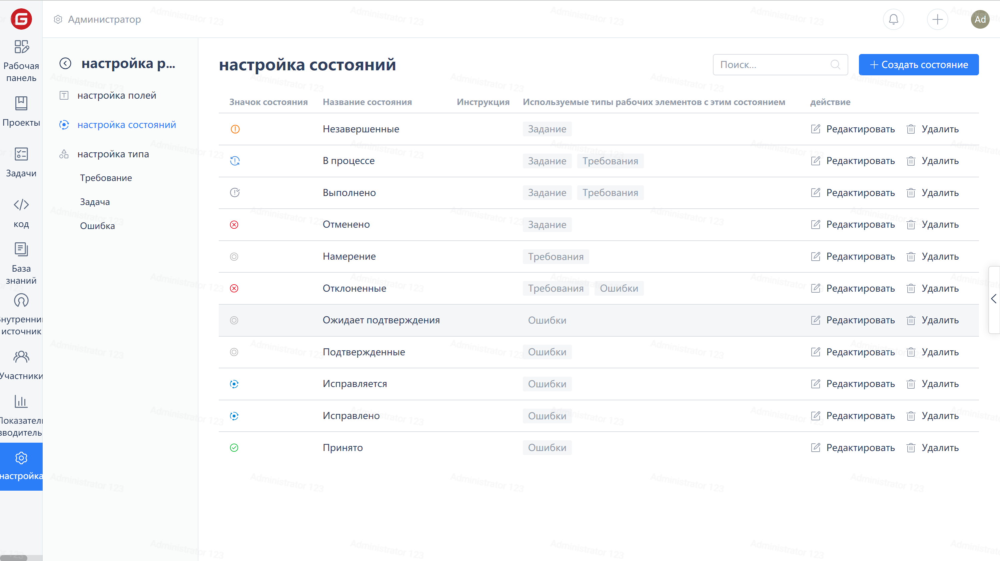
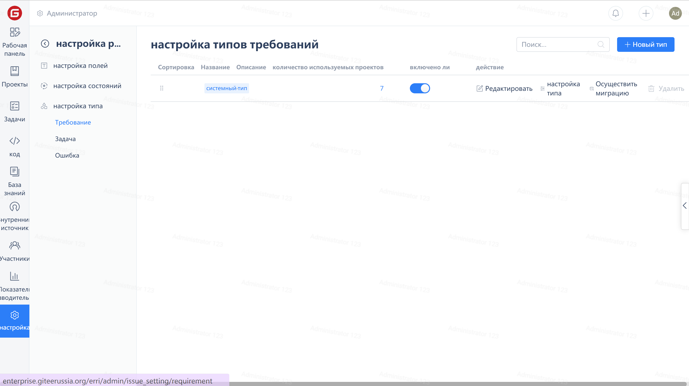
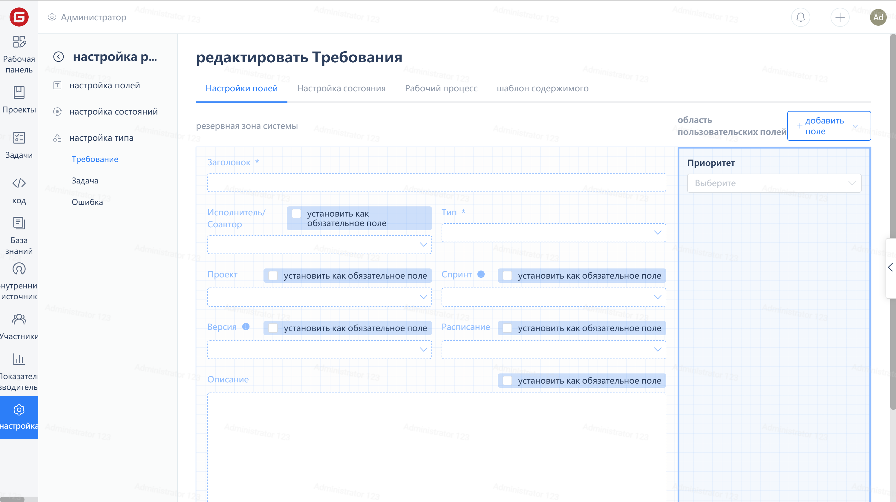
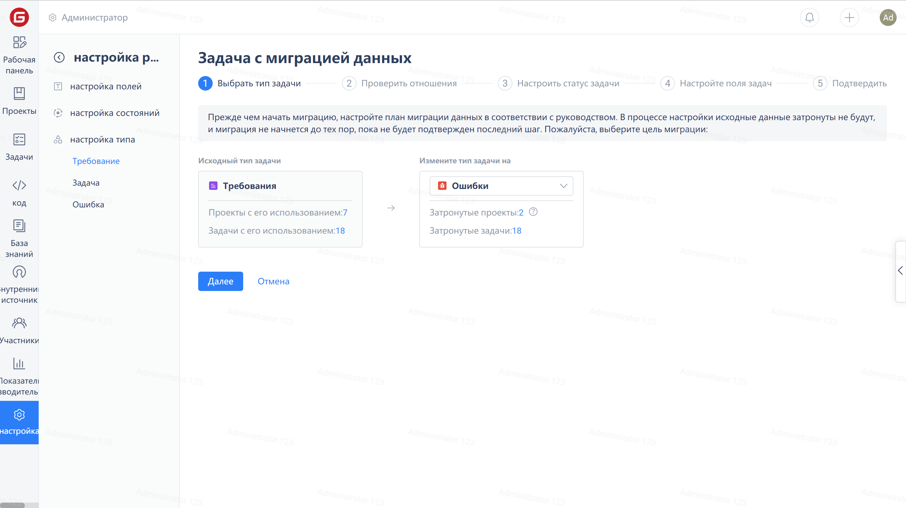

## Field Settings

Custom fields can be created or deleted in the 'Field Settings' page for use by various work item types.

## Status Settings

On the "Status Settings" page, you can create and delete statuses.

Type Settings

In the 'Type Settings' page, you can view information and usage of each work item type and perform editing, configuration, migration, and deletion operations on them.

### Configuration Type

On the 'Type Settings' page, click on the 'Configure Types' link, and you can configure the fields, states, workflows, and content templates for this work item type in the configuration page.

Data Migration

To bulk modify the type of a certain class of work items, you can click on the "Data Migration" link in the "Type Settings" page to enter the data migration page for that type.

