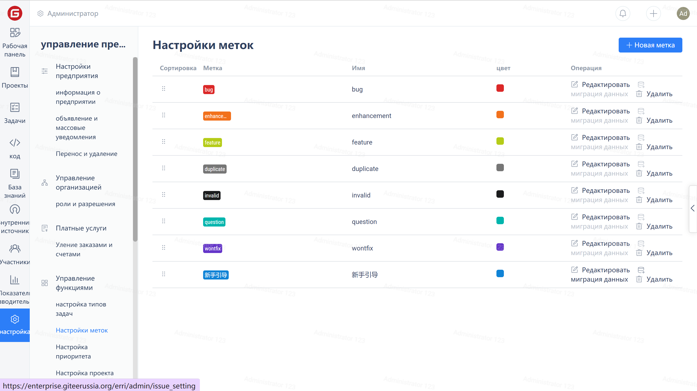
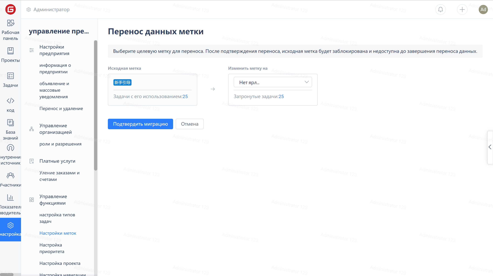

Tags are used to classify and search for work items and code reviews (Pull Requests).

You can create, edit, and delete tags in the "Tag Settings" page.

If you need to replace or cancel the use of a certain tag, you can click on the "Data Migration" link to enter the data migration interface for operation.

