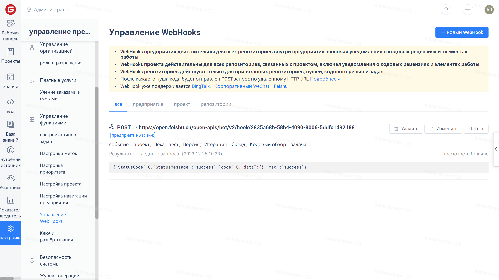

Функция вебхуков Gitee автоматически обратится к указанному HTTP-адресу после того, как пользователь отправит код.

> Это общее решение. Пользователи могут написать собственные скрипты на основе различных потребностей (например, отправка электронных писем, автоматическое развертывание и т. д.).

Сравнение вебхуков компании и вебхуков репозитория:

- Вебхуки компании действуют для всех репозиториев в предприятии для событий отправки, запросов на слияние и задач.
- Вебхуки для репозиториев работают только для событий обытий отправки, запросов на слияние и задач, связанных с репозиторием.

Вы можете управлять вебхуками для компании, проектов и репозиториев на странице "Управление вебхуками".

## Структура и типы данных

Для получения информации о структуре данных и типа вебхука обратитесь к следующим документам:

- [Руководство по формату данных для передачи вебхуков](./push-data-format.md)
- [Алгоритм проверки и верификации секретного ключа вебхука](./verify.md)
- [Объяснение типов данных для передачи данных вебхуков](./push-data-type.md)

## Поддержка сторонних мессенджеров

Мы включили поддержку вебхуков для следующих сторонних приложений, чтобы пользователи могли получать уведомления о Gitee через них:

Робот DingTalk:

Настройте URL-адрес вебхука на адрес робота группового чата в Dingtalk.

Связанный документ: Вебхук добавляет поддержку для DingTalk

**Корпоративный Бот WeChat:**

Настройте URL-адрес вебхука на адрес робота WeChat Work в компании.

Связанный документ: Вебхук добавляет поддержку для WeChat Work

Настройте URL-адрес вебхука на адрес робота группового чата в Feishu.

Связанный документ: Вебхук добавляет поддержку для Feishu

Настройте URL-адрес вебхука на адрес Slack-бота.