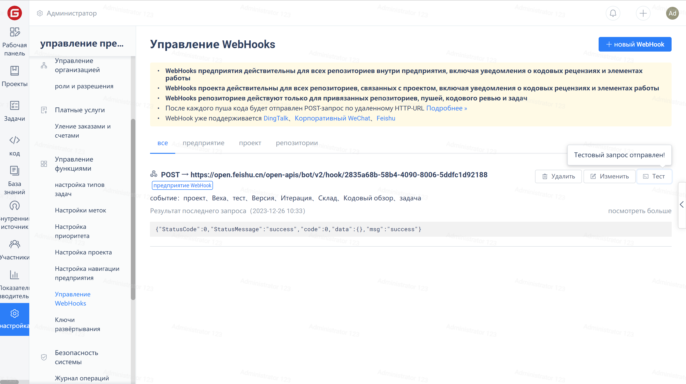

После добавления вебхука вы можете проверить его работоспособность.

Нажмите на "Управление" в меню навигации предприятия, затем выберите опцию "Управление вебхуками" и, наконец, нажмите кнопку "Тест" в правом верхнем углу целевого вебхука. Gitee отправит тестовые данные по указанному URL-адерсу.

