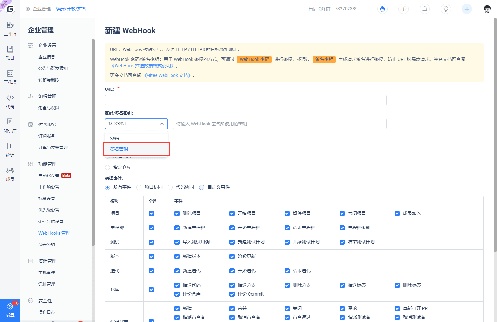

DingTalk предоставляет функцию "Умного ассистента группы" в групповых чатах. С помощью вебхука вы можете добавить пользовательских ботов в DingTalk для автоматических уведомлений.

## Добавление бота

В чате группы DingTalk перейдите в 'Настройки группы' -> 'Умный ассистент группы' -> 'Добавить бота' и выберите 'Пользовательский' бот. Установите профильную картинку и имя для бота, нажмите 'Добавить', чтобы получить адрес вебхука, и нажмите 'Завершить', чтобы закончить добавление бота DingTalk.

Настройка вебхука для бота

Получите URL-адрес вебхука в процессе добавления робота. URL-адрес будет похож на  'https://oapi.dingtalk.com/robot/send?access_token=xxxxxxxxxxxxxxxxx'. Добавьте этот URL в Gitee для завершения конфигурации вебхука.

Перейдите на страницу репозитория на Gitee и выберите "Управление" -> "Настройки вебхуков" -> "Добавить" для добавления нового вебхука.

Заполните поле URL полученным адресом вебхука. Для поля "Пароль/Ключ подписи вебхука" выберите "Ключ подписи" и введите соответствующее содержимое ключа подписи, предоставленное в настройках бота. Выберите конкретные события-триггеры, активируйте и добавьте, чтобы завершить настройку вебхука.

## Настройки безопасности

Боты Dingtalk поддерживают функции 'Пользовательские ключевые слова', 'Подпись' и 'IP-адрес (диапазон)', которые используются для усиления безопасности приема запросов бота и предотвращения вредоносных запросов.

### Пользовательские ключевые слова

После установки пользовательских ключевых слов будет активирован только при получении запросов вебхука, содержащих указанные пользовательские ключевые слова. Можно определить до 10 ключевых слов.

### Контрольная подпись

Установка подписи позволяет обеспечить подпись запроса бота DingTalk для обеспечения более высокой безопасности.

### Белый список IP-адресов 

Установка диапазона IP-адресов позволяет ограничить белый список IP-адресов, с которых могут быть выполнены запросы на активацию бота. Поскольку диапазон IP-адресов запросов услуг Gitee не фиксирован, не рекомендуется устанавливать белый список IP-адресов (диапазон), чтобы избежать проблем с нормальной активацией бота DingTalk.

Триггеринг вебхуков DingTalk

Запросы WebHook в DingTalk срабатывают при настройке робота в следующих случаях:

- Push: Отправка кода в репозиторий, создание и удаление веток
- Tag push: Создание и удаление тегов
- Issue: Создание, закрытие, повторное открытие, удаление задач или изменение назначенных исполнителей
- Pull request: Создание запроса на слияние, обновление запроса на слияние, объединение запроса на слияние
- Comment: Комментарии к репозиториям, задачам, запросам на слияние, коммитам

## Связанные материалы

- [Поддержка вебхуков Gitee для WeChat Work](/help/articles/4296)