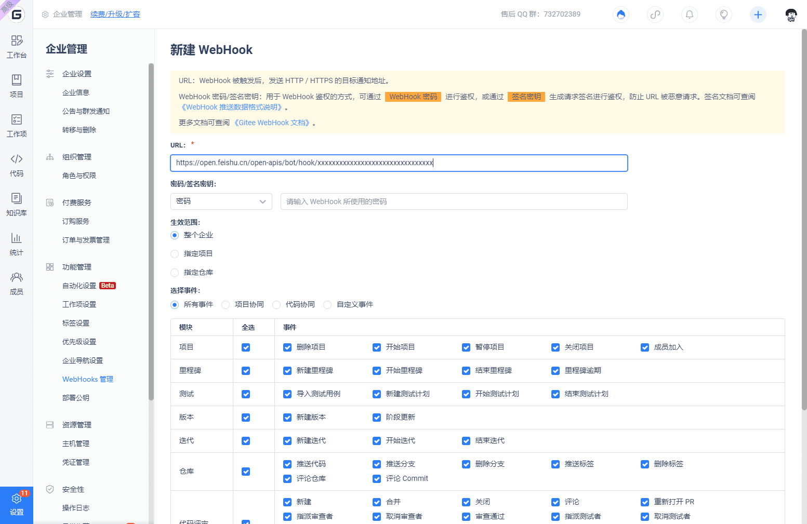

Feishu provides the 'Group Robot' feature in internal group chats. By using WebHooks, you can add custom robots to Feishu for automatic notifications.

## Add Robot

In Feishu group chat, go to the right side `Settings` -> `Group Robots` -> `Add Robot`, choose `Custom Bot`, set an avatar and name for the robot, click `Add` to get a

> Currently, group chats containing external contacts do not support adding robots.

Set up robot WebHook

When adding the webhook in the previous step, you will get a webhook request URL like `https://open.feishu.cn/open-apis/bot/hook/xxxxxxxxxxxxxxxxxxxxxxxxxxxxxxxx`. Add this URL to Gitee to complete the webhook setup.

Click on 'Management' in the enterprise navigation menu, then click on 'WebHooks Management', and then click on the 'New WebHook' button in the upper right corner to enter the new WebHook page.

Fill in the webhook address obtained from the previous section into the URL, select the specific trigger event, activate and add to complete the setup of the webhook.

## Trigger WebHooks

By setting up a bot, the following scenarios will trigger WebHook requests to Feishu.

- Push: Repository pushes code, pushes branches, deletes branches
- Tag push: Create tag, delete tag
- Issue: Create, close, reopen, delete tasks, or modify task assignees
- Pull request: Create pull request, update pull request, merge pull request
- Comment: Comment on repositories, issues, pull requests, commits