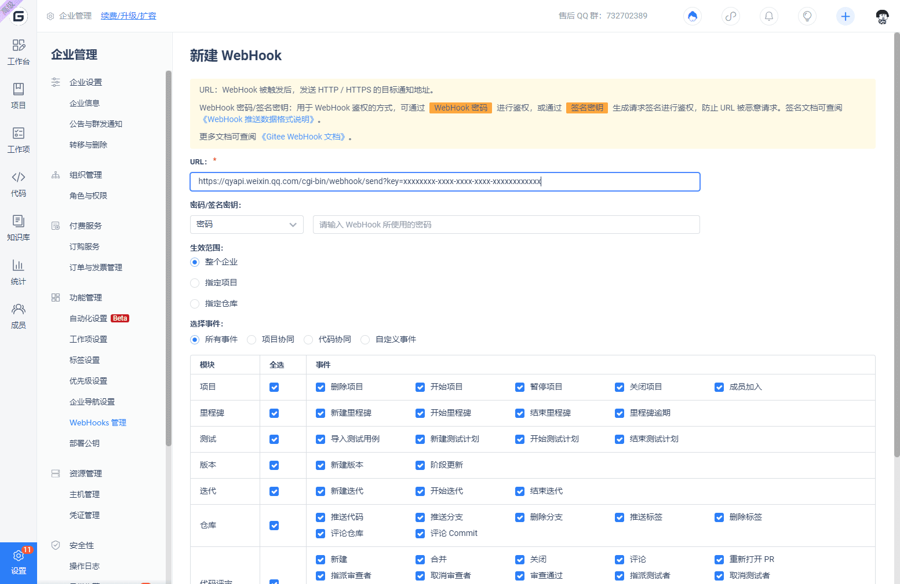

Корпоративный WeChat предоставляет функцию "Групповой робот" во внутренних групповых чатах. С помощью вебхуков вы можете добавить пользовательских роботов в Корпоративном WeChat для автоматических уведомлений.

## Добавление робота

В корпоративном чате WeChat выберите "Добавить группового робота" -> "Создать нового робота" из контекстного меню в правом верхнем углу окна чата. Установите аватар и имя для робота, а затем нажмите "Добавить", чтобы получить адрес вебхука. Закройте окно, чтобы завершить добавление робота WeChat во внутреннюю группу корпоративного WeChat.

> В настоящее время групповые чаты с внешними контактами не поддерживают добавление роботов.

Настройка вебхука робота

При добавлении вебхука на предыдущем шаге вы получите URL-адрес запроса вебхука, например 'https://qyapi.weixin.qq.com/cgi-bin/webhook/send?key=xxxxxxxx-xxxx-xxxx-xxxx-xxxxxxxxxxxx'. Добавьте этот URL-адрес в Gitee, чтобы завершить настройку вебхука.

На странице репозитория в Gitee перейдите в "Управление" -> "Настройки вебхуков" -> "Добавить", чтобы добавить новый вебхук.

Заполните полученный URL-адрес вебхука в поле URL, выберите конкретное событие-триггер, активируйте и добавьте, чтобы завершить настройку вебхука.

## Белый список IP-адресов

Установка диапазона IP-адресов позволяет ограничить белый список IP-адресов, с которых могут быть выполнены запросы на активацию робота. Поскольку диапазон IP-адресов запросов услуг Gitee не фиксирован, не рекомендуется устанавливать белый список IP-адресов (диапазон), чтобы избежать проблем с нормальной активацией бота.

## Триггеры вебхуков

Следующие сценарии вызовут запросы вебхука к WeChat Work.

- Push: Репозиторий пушит код, создает ветки, удаляет ветки
- Tag push: Создание тега, удаление тега
- Issue: Создание, закрытие, повторное открытие, удаление задач или изменение назначенных исполнителей задачи
- Pull request: Создание запроса на слияние, обновление запроса на слияние, объединение запроса на слияние
- Comment: Комментарии к репозиториям, задачам, запросам на слияние, коммитам