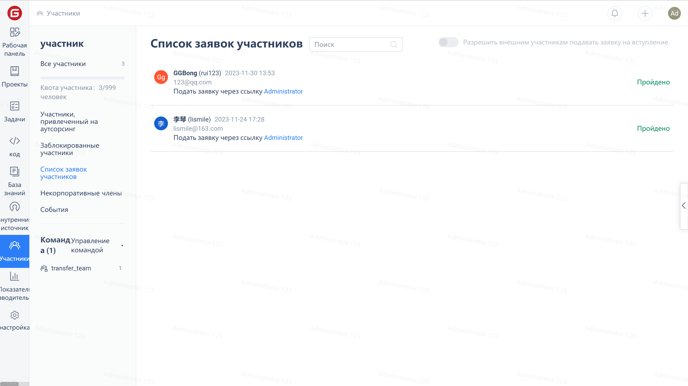

Нажмите на выпадающее меню "+" и выберите опцию "Добавить участника", чтобы быстро перейти на страницу приглашения участника.

Вы также можете нажать на "Участники" в меню навигации компании, а затем на кнопку "Пригласить участников" в верхнем правом углу страницы, чтобы перейти на страницу приглашения участников.

В интерфейсе "Пригласительная ссылка" вы можете пригласить других присоединиться к компании, поделившись пригласительной ссылкой и QR-кодом.

В интерфейсе "Пригласить по электронной почте" вы можете указать адрес электронной почты приглашаемого и отправить ему пригласительную ссылку.

Если выбрана опция "Требуется подтверждение администратора", после успешного приглашения участника необходимо перейти на страницу "Список заявок на вступление" для обработки запроса на вступление участника.

