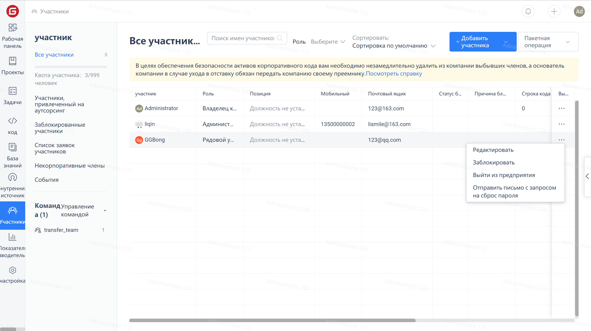
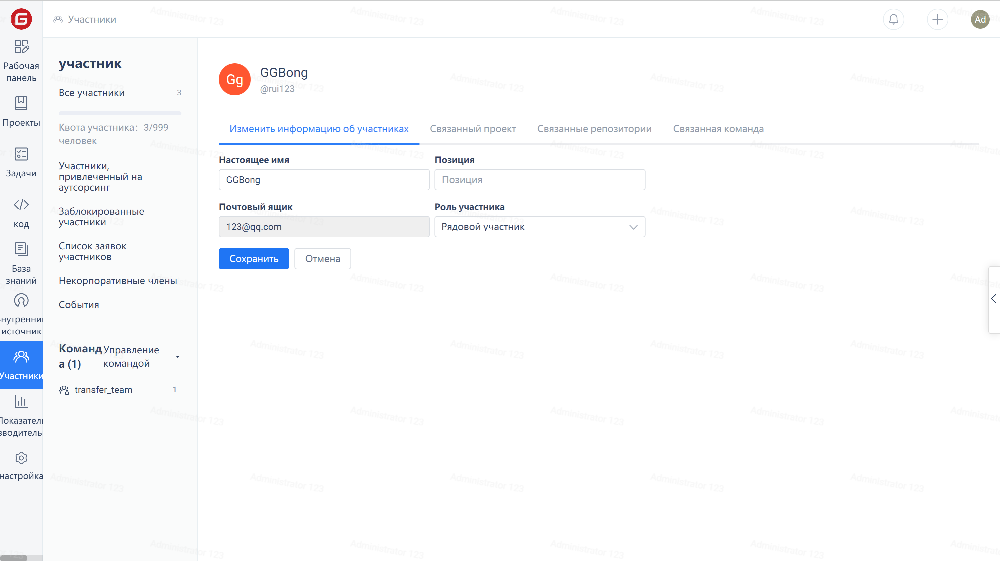

Click on the "Members" in the enterprise navigation menu to enter the member management page, then click "..." on the right side of the target member's row, and then click "Edit" in the dropdown menu.

Click on the 'Member Role' selection box in the 'Edit Member Information' interface, then select a role from the drop-down menu, and finally click the 'Save' button.

