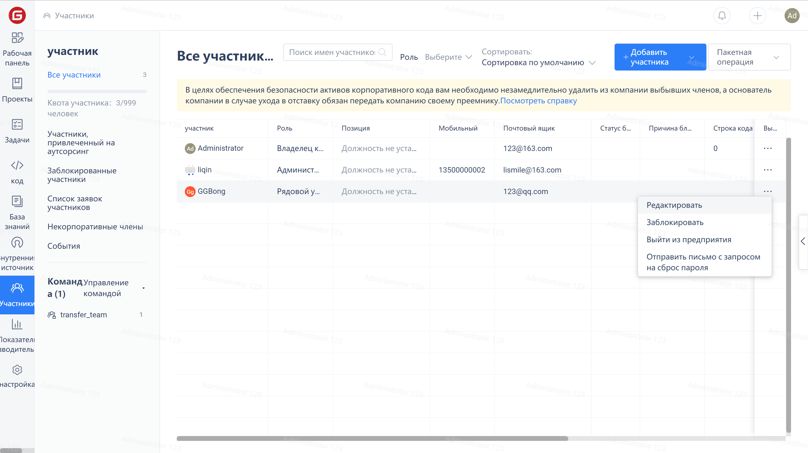
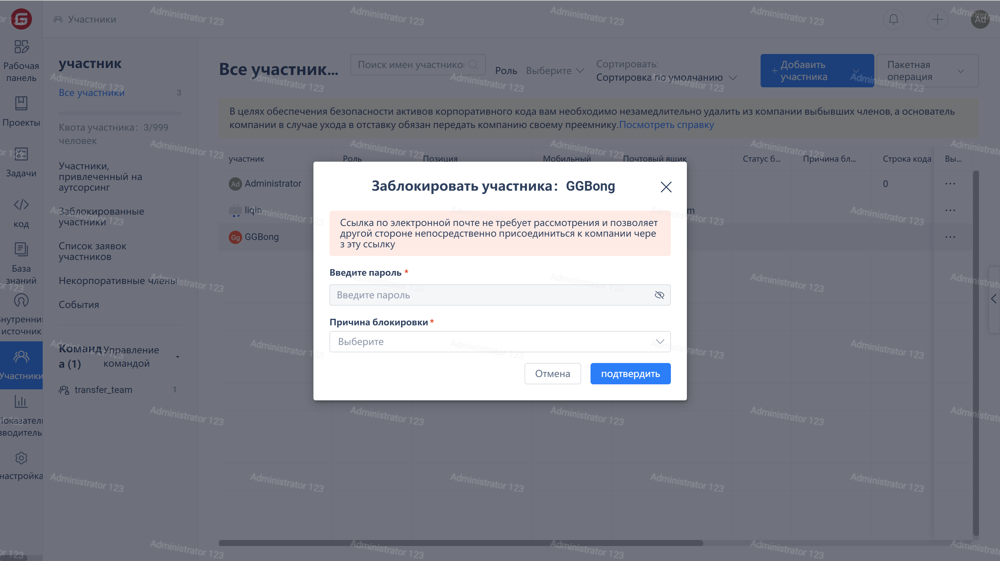

Нажмите на "Участники" в меню навигации компании для перехода на страницу управления участниками. Затем щелкните на "..." справа от строки целевого участника и выберите опцию "Заблокировать" в выпадающем меню.

Во всплывающем окне верификации введите метод верификации и причину блокировки.

После блокировки пользователя он не сможет получить доступ к вашей компании обычным образом. Чтобы разблокировать его, нажмите "Разблокировать" в меню операций с участниками.