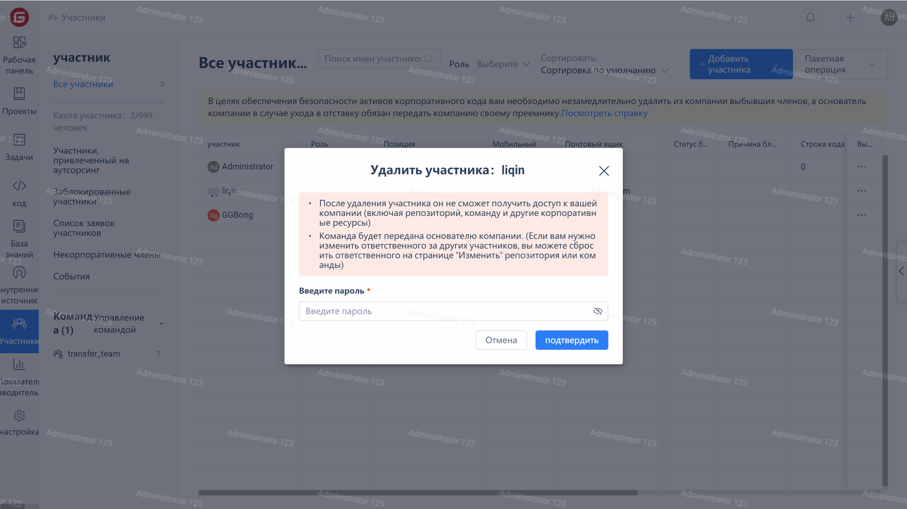

Нажмите на "Сотрудники" в меню навигации компании, чтобы перейти на страницу управления сотрудниками. Затем щелкните на "..." справа от строки целевого сотрудника и в выпадающем меню выберите опцию "Удалить из компании" для удаления сотрудника из компании.

