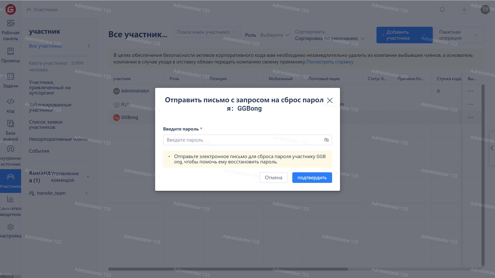

Click on the "Members" in the enterprise navigation menu to enter the member management page, then click on the "..." on the right side of the target member's row, and then click on the "Send password reset" option in the drop-down menu. The user will receive an email to reset the password.

