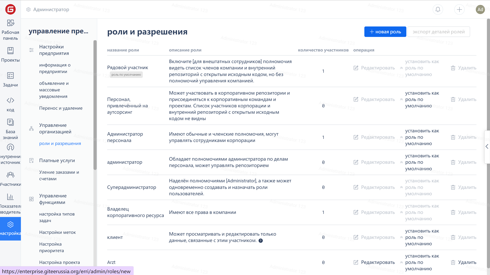
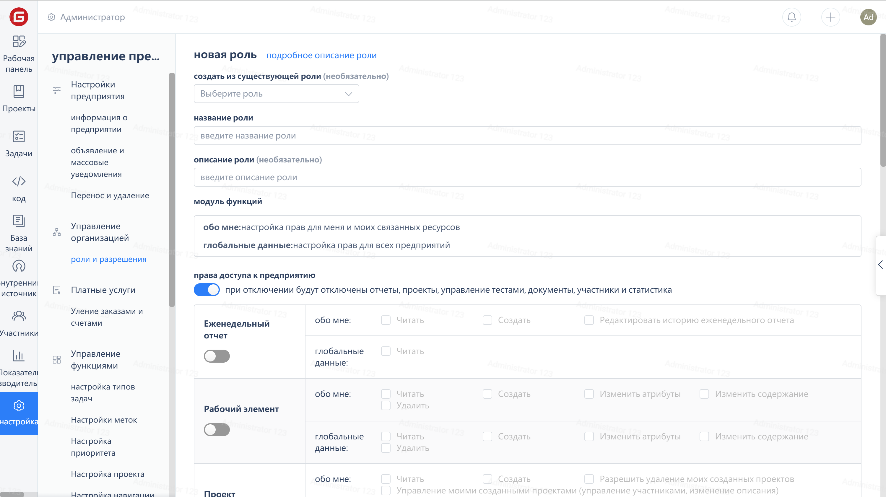

## View Roles

Click on the Enterprise Navigation menu 'Settings' - 'Roles and Permissions' to enter the Role Management page, click on the role name to view the detailed permission configuration of that role.

## Custom Roles

When the default roles of the enterprise do not meet the requirements or there are more permission settings, custom roles can be created.

Click the enterprise navigation menu "Settings" - "Roles and Permissions", then click the "New Role" button in the upper right corner of the page:

Configure various permissions in the role creation page:

