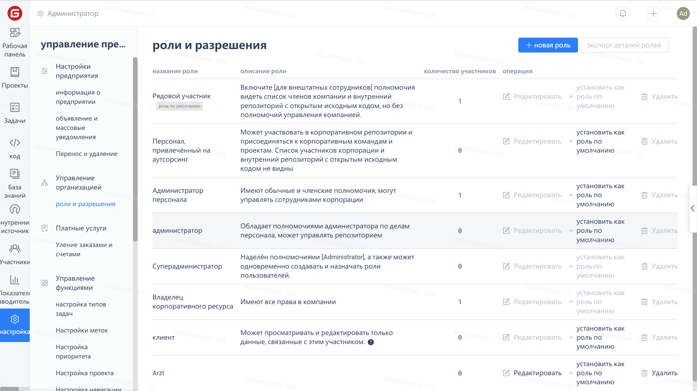

## Просмотр ролей

Нажмите на элемент меню "Настройки" в навигационном меню компании, затем выберите "Роли и разрешения", чтобы войти на страницу управления ролями. Нажмите на название роли, чтобы просмотреть подробную конфигурацию разрешений этой роли.

## Пользовательские роли

Когда стандартные роли компании не соответствуют требованиям или требуется больше настроек разрешений, можно создать пользовательские роли.

Нажмите на элемент меню навигации компании "Настройки" - "Роли и разрешения", затем нажмите кнопку "Новая роль" в правом верхнем углу страницы:

Настройте нужные разрешения на странице создания роли:

