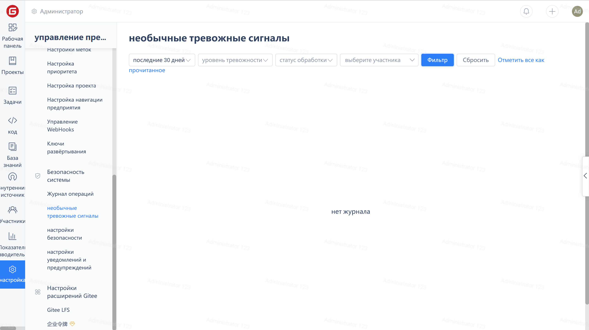

When there are abnormal alarm records in the company, the 'Settings' in the company's function menu and the 'Abnormal Alarm' in the company management menu will have a mark indicating the number of alarms.

Click "Settings" - "Exception Alert" to filter and view the exception alert records of enterprise members on the "Exception Alert" page. After handling the exception alert, you can mark these alert records as read.

