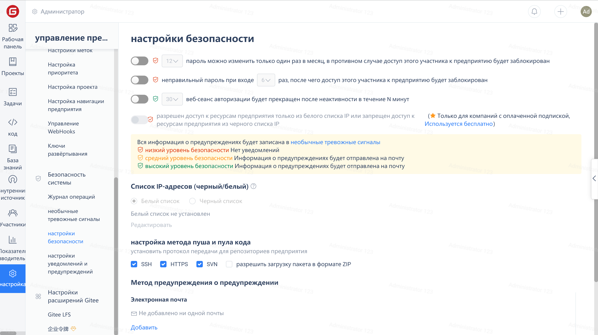
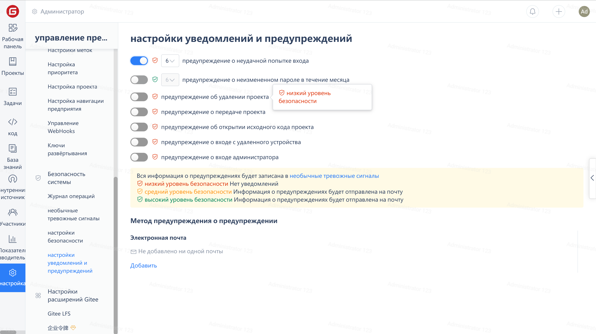
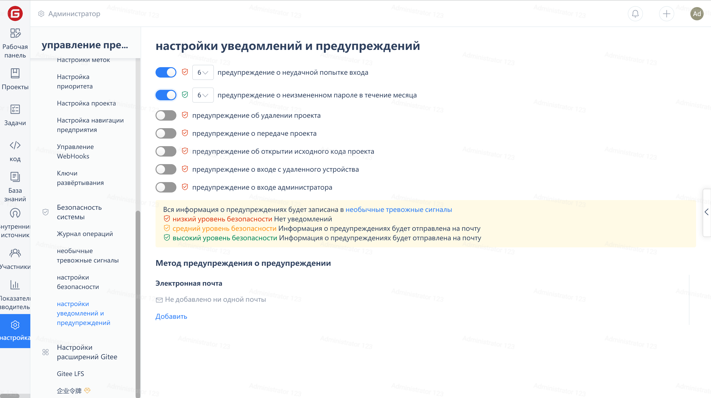
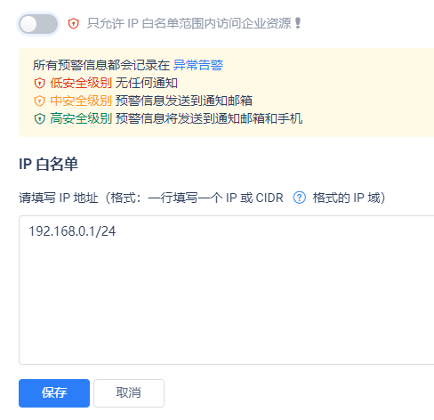
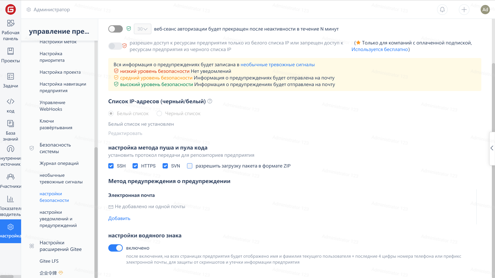
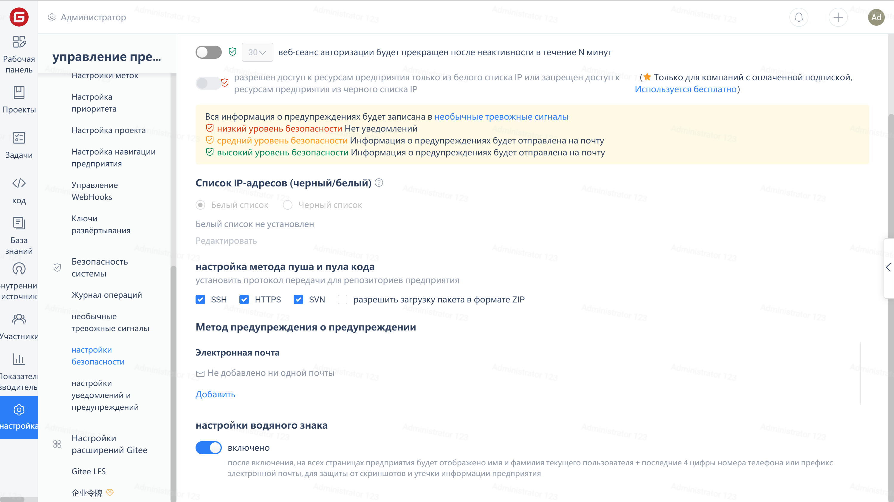

В меню навигации компании нажмите «Настройки», найдите категорию «Безопасность» в меню управления компанией и нажмите в этой категории «Настройки безопасности» для перехода на страницу настроек безопасности.

## Повышение безопасности паролей участников

Включите ограничение частоты обновления паролей, чтобы заставить участников регулярно обновлять свои пароли для повышения их безопасности.

## Предотвращение взлома паролей участников

В целях предотвращения подбора паролей участников другими лицами включите ограничение ошибок ввода пароля.

## Ограничение IP-доступа к корпоративным ресурсам

Добавьте IP-домен локальной сети в белый список, чтобы корпоративные ресурсы были доступны только компьютерам внутри локальной сети и не могли быть доступны внешним машинам.

## Запретить участникам загружать репозиторий

Снимите флажок «Разрешить загрузку пакета ZIP» в «Настройки загрузки и отправки кода».

## Предотвращение утечки снимков экрана

После включения водяного знака он может помешать участникам компании делать снимки экрана для утечки информации.

