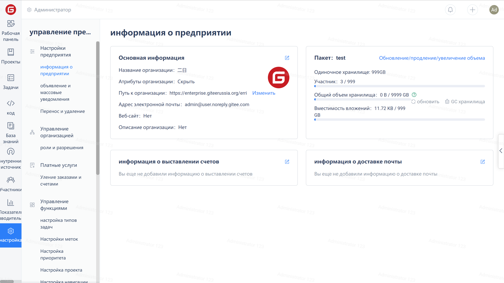
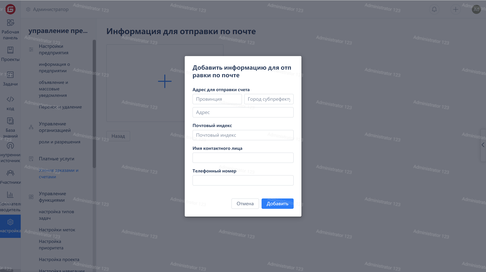

Click on the 'Settings' in the enterprise navigation menu to enter the enterprise information page, then click on the edit icon in the upper right corner of the 'Mailing Information' card:

Click the "+" card in the mailing information page to add mailing information:

After filling in the mailing information, click the "Add" button to complete the addition.