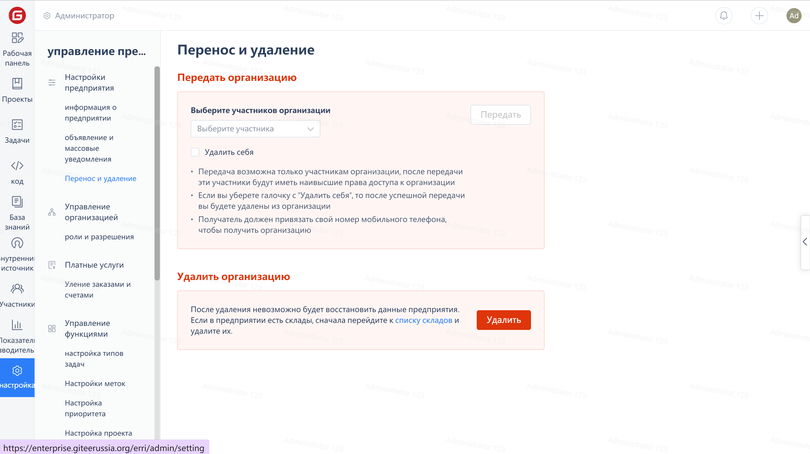

1. Click on the 'Settings' in the enterprise navigation menu to enter the enterprise information page
1. Click on the 'Transfer and Delete' option in the Enterprise Management menu
1. Click the 'Delete' button on the right side of 'Delete Enterprise' and complete the verification in the pop-up verification window.

