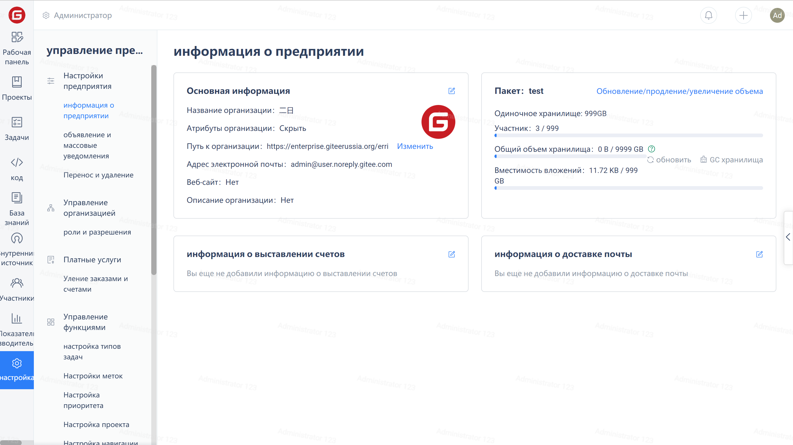
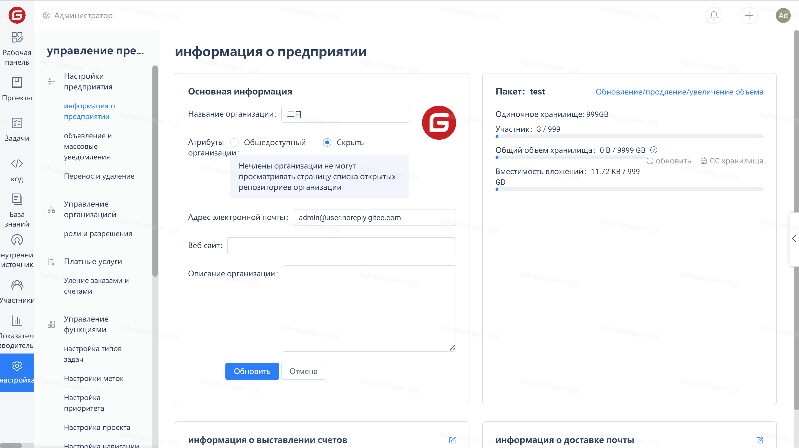
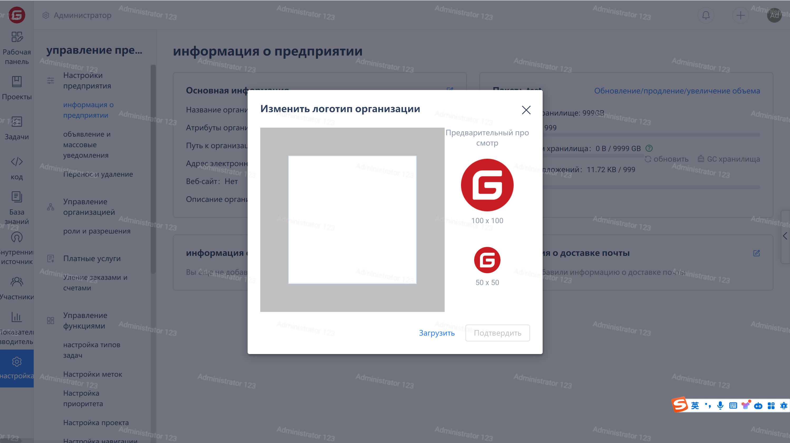

Click on the 'Settings' in the company navigation menu to enter the company information page.

## Edit basic information

Click on the edit icon in the upper right corner of the basic information card to edit the basic information.

## Change Enterprise Logo

Click on the LOGO on the right:

In the pop-up window, click the 'Upload' link, select a suitable LOGO image, then adjust the position and size of the image in the left area. After adjustment, click the 'OK' button to update the enterprise.

