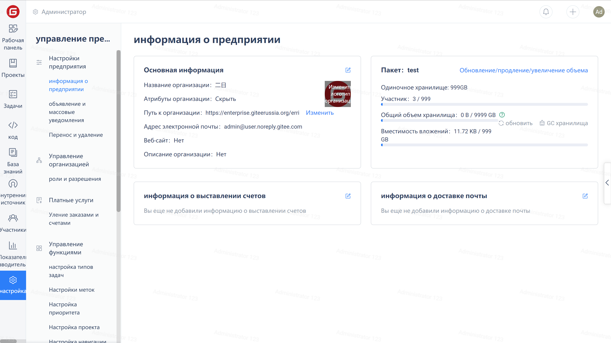

Для перехода на страницу информации о компании нажмите «Настройки» в меню навигации компании.

## Редактирование основной информацию

Чтобы отредактировать основную информацию, нажмите на значок редактирования в правом верхнем углу карточки основной информации.

## Изменение логотипа предприятия

Нажмите на ЛОГОТИП справа:

Во всплывающем окне нажмите ссылку «Загрузить», выберите подходящее изображение ЛОГОТИПА, затем отрегулируйте положение и размер изображения в левой области. После настройки нажмите кнопку «ОК», чтобы обновить предприятие.

