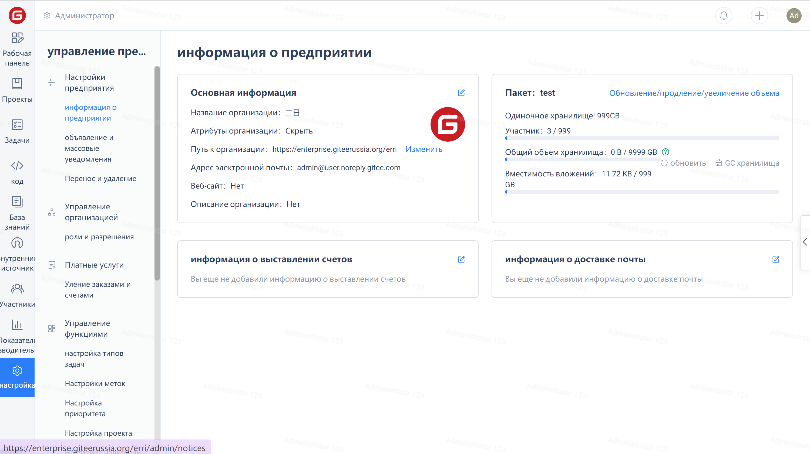
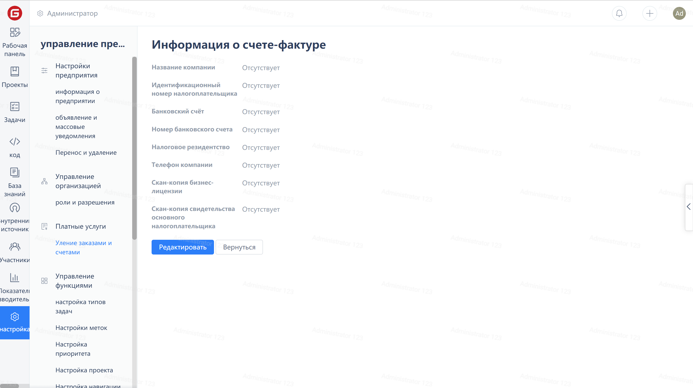
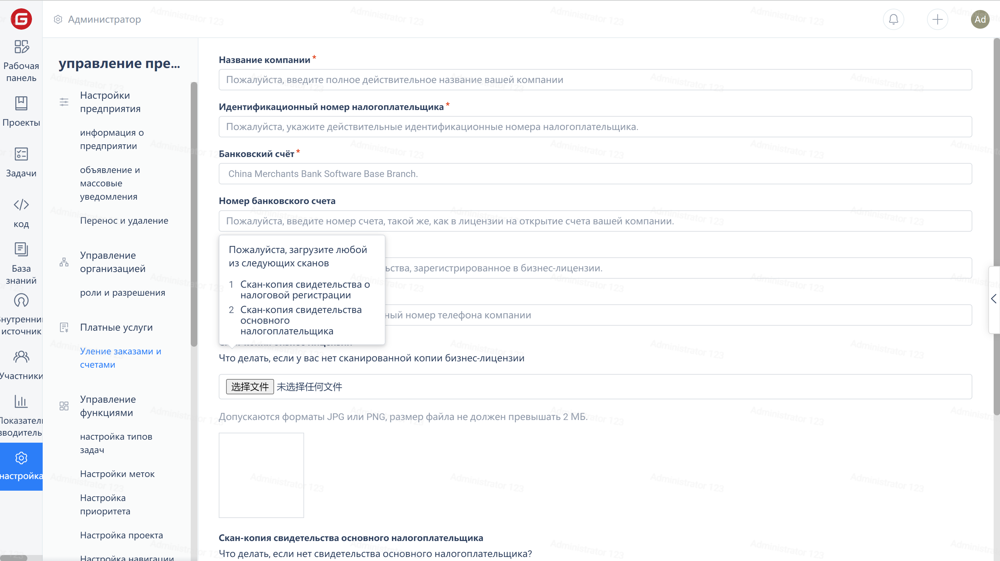

Для перехода на страницу информации о компании нажмите «Настройки» в меню навигации компании, затем нажмите на значок редактирования в правом верхнем углу карточки «Информация для выставления счетов»:

Нажмите кнопку «Редактировать» на странице платежной информации:

Заполните информацию о счете в соответствии с подсказками на странице, а затем нажмите кнопку «Отправить», чтобы завершить регистрацию информации о счете.

