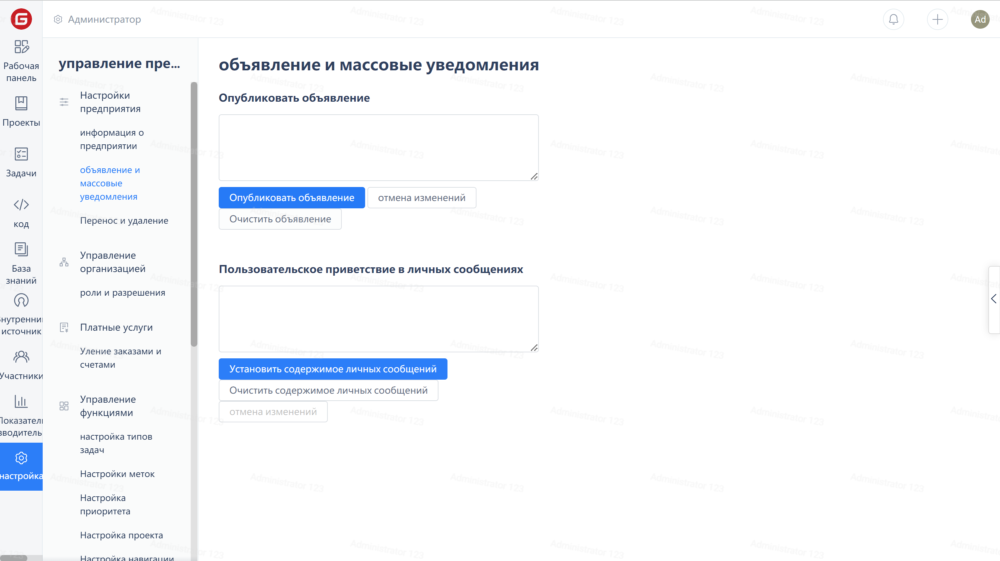
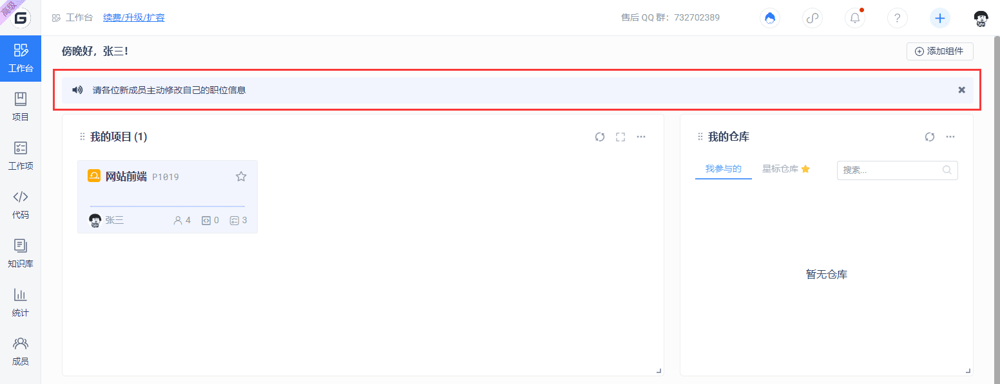
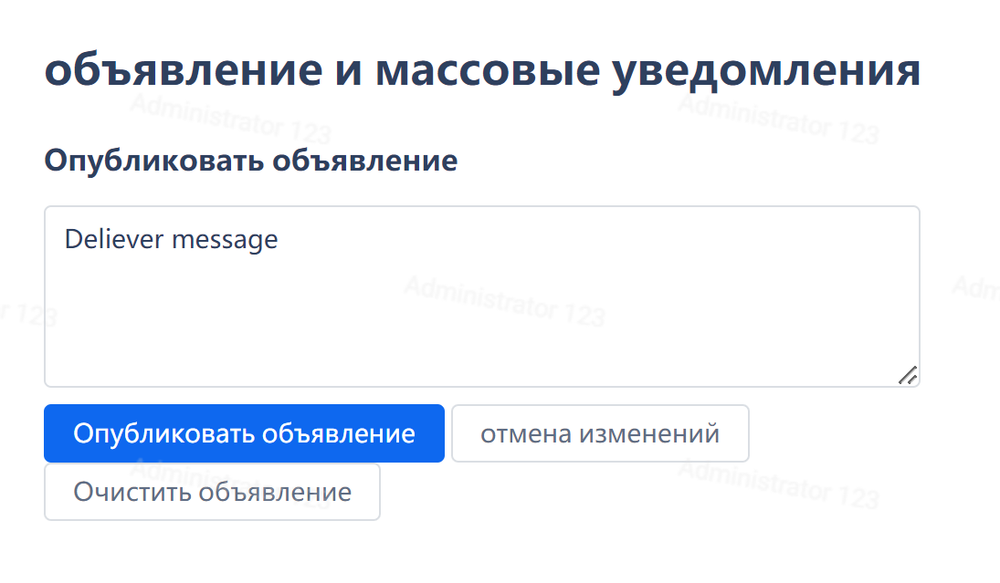
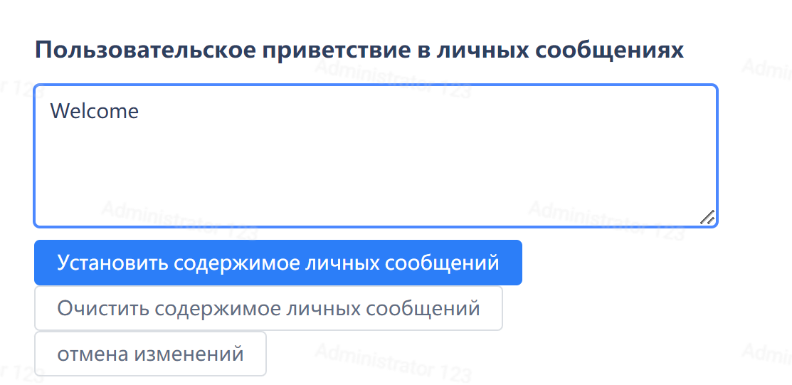

Click on the 'Settings' in the enterprise navigation menu, then click on 'Announcements and Mass Notifications' to enter the announcement and welcome private message management page.

## Release Announcement

Fill in the announcement content in the input box under 'Publish Announcement', then click the 'Publish Announcement' button.

Newly published announcements will be displayed at the top of the 'Dashboard' page.

## Clear Announcement

Click the 'Clear Announcement' button, then click the 'Publish Announcement' button.

## Set Welcome DM

Fill in the input box under 'Custom Welcome Private Message' with the private message content, then click 'Set Private Message Content' button. After setting, new members joining the company will receive this private message.

