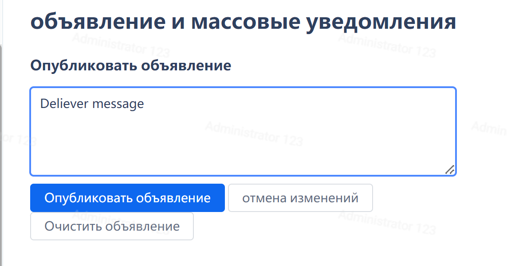

Нажмите «Настройки» в меню навигации компании, затем нажмите «Объявления и массовые уведомления», чтобы перейти на страницу управления объявлениями и уведомлениями.

## Объявление о релизе

Заполните содержание объявления в поле ввода в разделе «Опубликовать объявление», затем нажмите кнопку «Опубликовать объявление».

Недавно опубликованные объявления будут отображаться в верхней части страницы «Панель управления».

## Очистка объявления

Нажмите кнопку «Очистить объявление», затем нажмите кнопку «Опубликовать объявление».

## Настройка приветственного сообщения

Заполните поле ввода в разделе «Пользовательское приветственное личное сообщение» содержимым личного сообщения, затем нажмите кнопку «Установить содержимое личного сообщения». После настройки новые участники, присоединяющиеся к компании, получат это личное сообщение.

