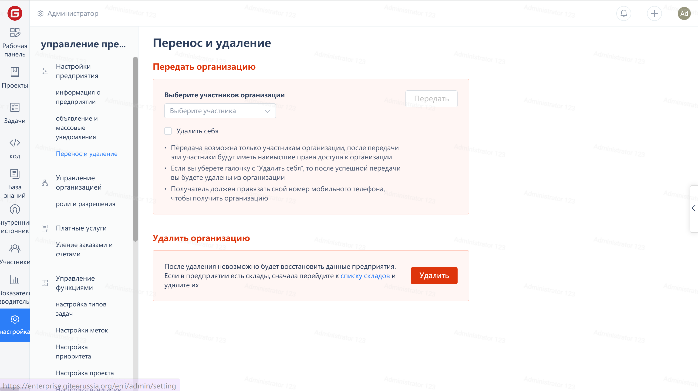

1. Click on the 'Settings' in the enterprise navigation menu to enter the enterprise information page
1. Click on the 'Transfer and Delete' option in the Enterprise Management menu
1. Click on the member selection box under "Transfer Enterprise" and select an enterprise member as the receiving party.
1. Click the "Transfer" button and complete the verification in the subsequent popup verification window.

