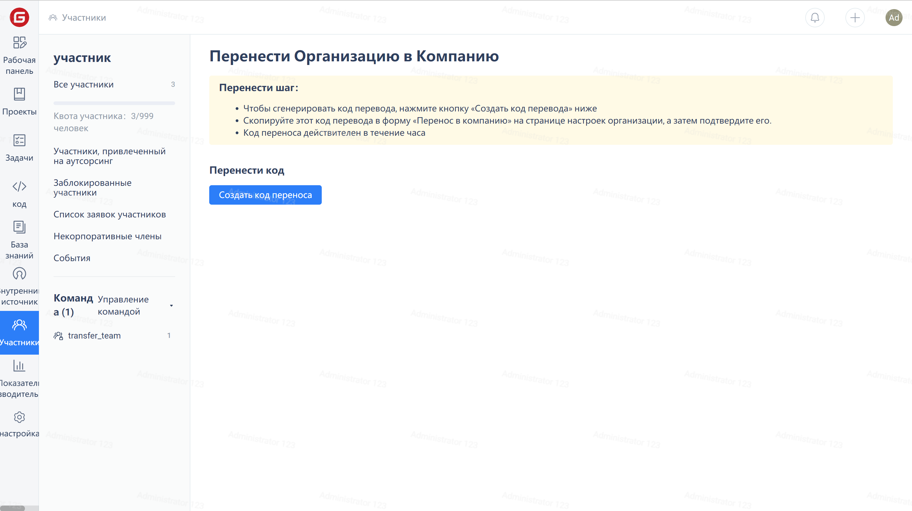
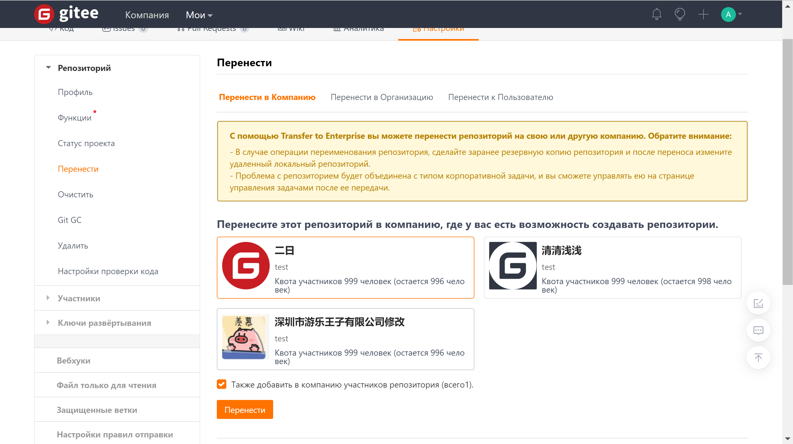

Для перехода на страницу управления участниками нажмите «Участники» в меню навигации компании, затем нажмите «Управление командой» в меню «Команда», затем нажмите кнопку «Создать код передачи» и скопируйте код передачи.

Перейдите на страницу «Настройки» организации, нажмите «Перевести в компанию» в левом меню, заполните только что скопированный на странице код перевода, а затем нажмите кнопку «Перевести».

