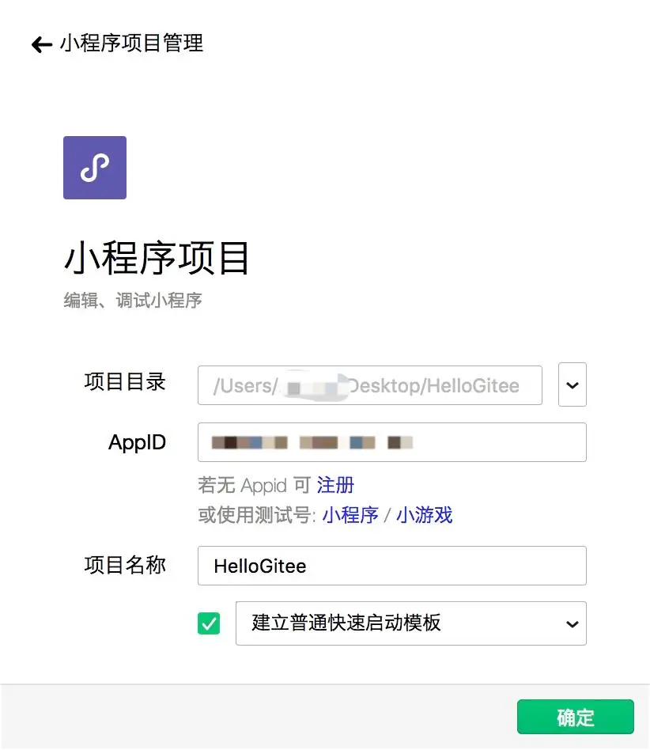
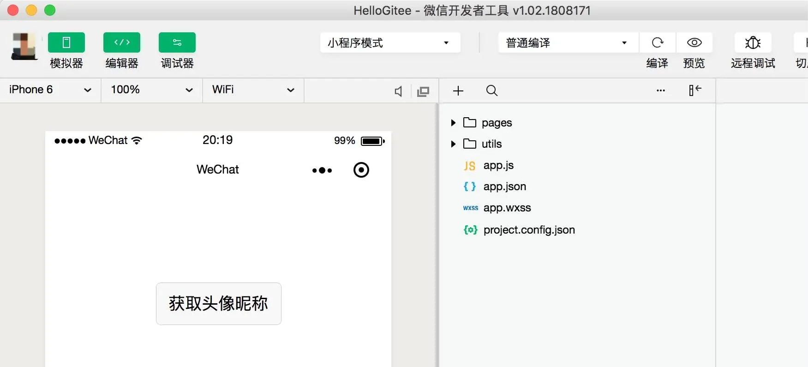
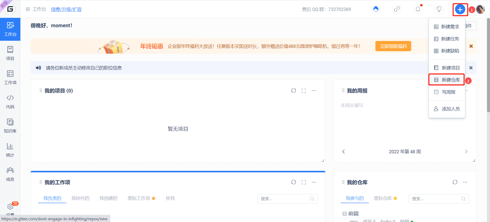
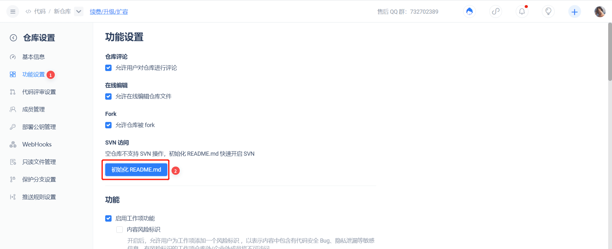
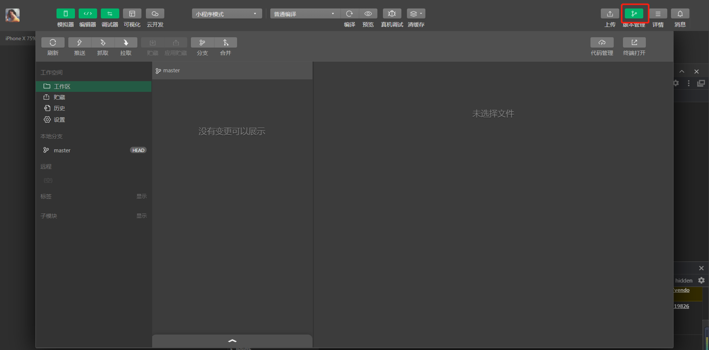
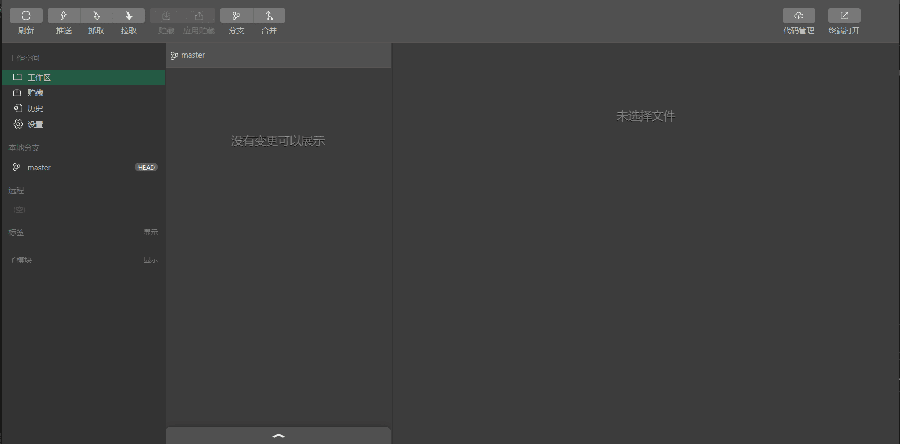
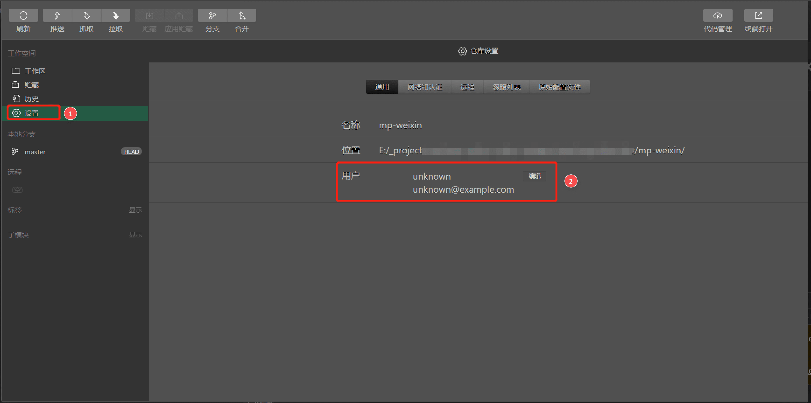
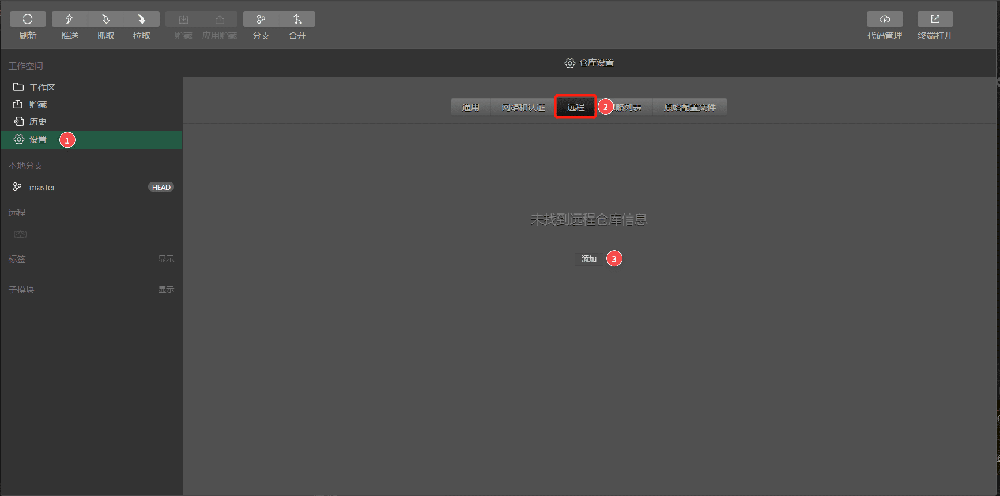
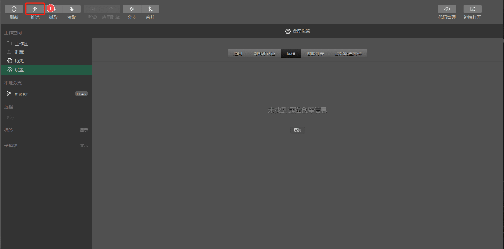
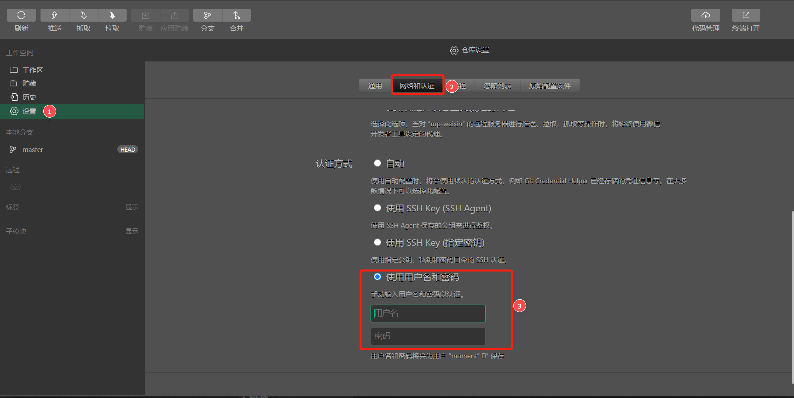

### **Предисловие**

В процессе разработки мини-программ WeChat управление версиями кода часто требует использования сторонних инструментов. Хотя веб-инструмент разработки WeChat предоставляет подсказки о состоянии версии файла Git, фактический пользовательский опыт все еще неудовлетворителен.

После обновления инструментов веб-разработки WeChat последняя бета-версия теперь поддерживает прямое управление Git. В этой статье мы подробно расскажем об использовании Git для контроля версий инструментов веб-разработки WeChat.

### **Настройка сред разработки**

- Среда разработки: все применимые в Mac/Windows/ Linux
- Инструменты разработки: Бета-версия Инструментов веб-разработки WeChat, Git
- Сервис хостинга Git: Gitee

Чтобы использовать сервис Git, необходимо установить Git в вашей системе. Подробную информацию об установке Git и соответствующих окружающих сред Git можно найти в разделах "Начало работы с Git" и "Установка Git".

Поскольку поддержка функциональности управления Git в настоящее время находится в стадии бета-тестирования, в этой статье в качестве примера будет использоваться бета-версия инструментов веб-разработкуи WeChat. Зайдите на сайт https://developers.weixin.qq.com/miniprogram/dev/devtools/devtools.html, чтобы загрузить бета-версию инструментов веб-разработки WeChat (в дальнейшем тексте упоминается как инструменты веб-разработки WeChat).

### **Создание репозитория мини-программ**

Чтобы использовать Git для контроля версий, вам сначала нужно создать Git-репозиторий. Откройте инструменты веб-разработчика WeChat и создайте/откройте репозиторий для мини-программы. В этом примере предположим, что имя репозитория - HelloGitee. Заполните необходимые путь и идентификатор приложения, выберите обычный шаблон быстрого запуска, подтвердите и создайте репозиторий.



После завершения создания получаем инициализированный репозиторий.



### **Создание удаленного репозитория**

Войдите в свою учетную запись Gitee на [https://gitee.ru](https://gitee.ru/). Нажмите на кнопку "Новый" в верхнем правом углу и выберите **'Новый Репозиторий'**. Заполните соответствующую информацию о репозитории проекта.



После создания и инициализации удаленного репозитория мы получаем пустой репозиторий, как показано на рисунке. Адрес репозитория для проекта: https://gitee.ru/normalcoder/HelloGitee.git
Затем инициализируем локальный репозиторий Git.



### **Инициализация локального репозитория**

Чтобы открыть панель управления версиями в инструментах разработчика, нажмите кнопку "Управление версиями" на панели в "Инструментах веб-разработчика WeChat".

Поскольку это новый репозиторий, и репозиторий Git не был инициализирован, будет предложено инициализировать репозиторий Git. Нажмите **"Инициализировать репозиторий Git"**, затем нажмите "Подтвердить", чтобы завершить инициализацию локального репозитория.

**Этот шаг эквивалентен выполнению команды "git init".**

- "Управление версиями" - "Инициализировать репозиторий git"



После инициализации можно увидеть локальный репозиторий и текущий статус Git. На следующем рисунке показана панель управления версиями инструментов веб-разработчика WeChat после инициализации.



### **Настройка информации о репозитории**

Чтобы отредактировать используемые в Git имя пользователя и адрес электронной почты, после инициализации нажмите "Рабочее пространство" -> "Настройки" -> "Общие" -> "Редактировать". Этот шаг эквивалентен операции настройки в команде git config.

```bash
git config --global user.name "username"
git config --global user.email "email"
```

**Примечание: Настроенное здесь имя электронной почты должно совпадать с адресом электронной почты в Gitee https://gitee.ru, чтобы гарантировать учет в Git отправленной информации о сделанном вкладе.**


 
В настройках репозитория перейдите на вкладку "Удаленный". На этом этапе вы увидите сообщение "Информация об удаленном репозитории не найдена". Нажмите "Добавить" и введите ранее созданный адрес удаленного репозитория. Назовите репозиторий "главный" или выберите свое собственное имя.



После добавления вы сможете просматривать информацию об удаленной ветке в этом репозитории.

### **Отправка кода в удаленный репозиторий**

Нажмите на панели управления кнопку "Отправить", во всплывающем окне выберите "Отправить в новую ветку удаленного репозитория" и введите имя "master", чтобы указать, что отправка должна осуществляться в ветку удаленного репозитория.



После завершения процесса отправки мы можем увидеть информацию о ветке в разделе "Удаленный репозиторий". Зайдите в репозиторий на Gitee, и вы также сможете увидеть информацию о толчке. На данный момент мы успешно завершили процесс переноса кода из локального репозитория в удаленный репозиторий.

### **Ограничения и настройки авторизации личности**

Если при нажатии вы столкнетесь с сообщением об ошибке отправки, вам необходимо проверить авторизацию пользователя. Это указывает на то, что, возможно, инструменты веб-разработчика WeChat, не прочитали конфигурацию авторизации локального пользователя по ssh, и вам необходимо ввести информацию об авторизации пользователя в средстве разработки.


По завершении инициализации последовательно нажмите "Рабочая область" -> "Настройки" -> "Сеть и аутентификация" -> "Метод аутентификации", и вы сможете выбрать метод аутентификации для удаленных репозиториев. Значение по умолчанию -"Автоматический".

Выберите "Ввести имя пользователя и пароль", ниже введите свою учетную запись Gitee и пароль, а затем повторите операцию отправки.


### **Изменение и отправка кода**

Далее изменим наш код.

1. Нажмите кнопку "Контроль версий" на панели инструментов разработки, закройте панель "Контроль версий", откройте файл "pages/index/index.wxml", внесите необходимые изменения и сохраните.

2. Перейдите обратно на панель "Управление версиями", и вы увидите, что в текущей локальной ветке есть файл, ожидающий фиксации изменений. Выберите и отметьте этот файл для просмотра внесенных в него изменений.

3. Заполните сообщение о коммите в поле отправки ниже, нажмите "Отправить", и код будет отправлен в основную ветку локального репозитория. После отправки вы сможете просмотреть записи о коммите в ветке локального репозитория.

4. Затем снова отправим код из локальной ветки в удаленный репозиторий. Нажмите кнопку 'Отправка' на панели операций, выберите во всплывающем окне 'Отправить в следующую ветку удаленного репозитория', выберите главную ветку существующего удаленного репозитория, а затем нажмите 'OK'.

5. После завершения процесса отправки вы сможете увидеть отправленные изменения кода на соответствующей странице репозитория в Gitee.

### **Заключение**

В ходе выполнения описанных выше операций мы использовали функцию управления версиями инструментов веб-разработчика WeChat для контроля версии кода мини-программы и отправили ее в удаленный репозиторий Git.

В ходе разработки реального  проекта мы можем полностью использовать возможности Git для управления версиями и совместной работы, гибко сотрудничать с другими, тем самым стандартизируя управление кодом и эффективно взаимодействуя при разработке.