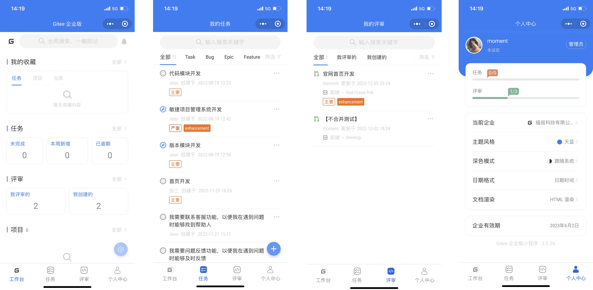
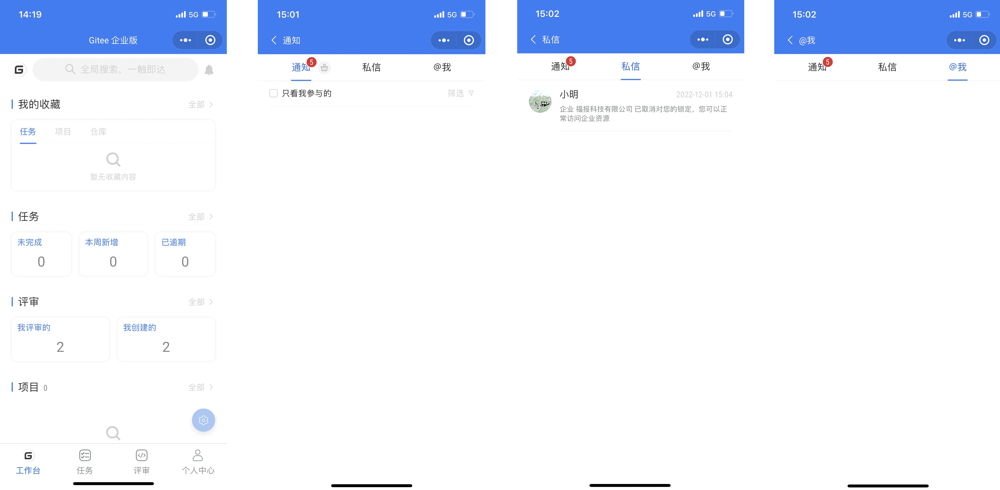
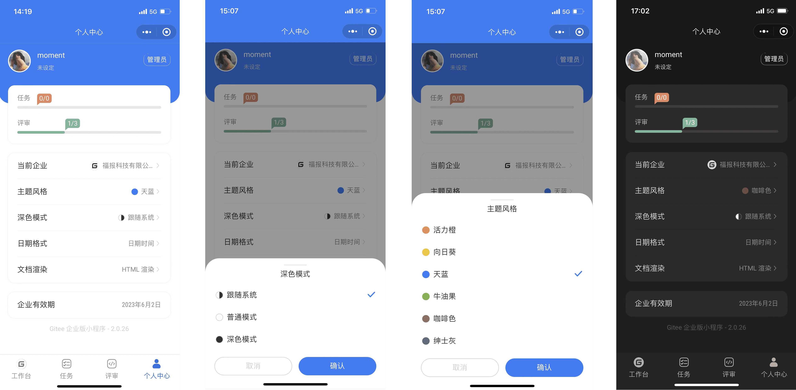

### **Mini Program Deployment:**

Gitee has created a lightweight office app for enterprise edition users.

### **Main Features**

1. Project, Repository: View project and repository information
2. Task: View tasks, create tasks, modify task status, comment/reply
3. Review: Review, view commit information, view code changes, comment/reply
4. Members: Member Information List
5. Message notification: Receive private messages, notifications, @me
6. My profile: switch company, mini program settings

 

### **How to use?**

1. Login to Gitee Mini Program to intuitively view enterprise resources.

 

2. Use mini program to create tasks anytime, anywhere;

When you create a new task in the mini program, you can perform the following operations:

- Select the project & repository ownership;
- Assign task owner & collaborators;
 - Tagging & Uploading attachments;
- Stash Task. (Exclusive to Mini Programs! Supports stashing multiple tasks)

 

3. PR can also be reviewed online;
When you review a PR in the mini program, you can perform the following operations:

 - View Code Changes;
 - Approved by review;
 - Passed testing;
 - Merge PR;
 - Close PR.

 
 
4. Real-time online notification, no missing any key information;

 
 
5. Set personal center, freely configure your own mini program.

 

Open WeChat to scan the following QR code and explore Gitee Enterprise Edition Mini Program together.

 