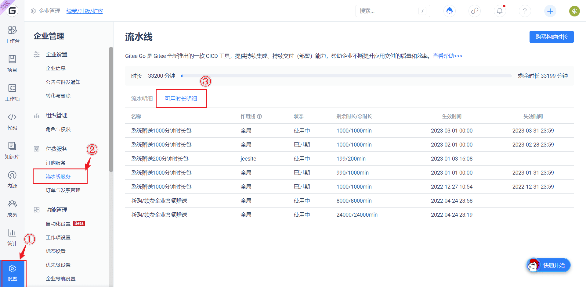

If your company's build duration exceeds the package limit, the pipeline may not run properly.

Duration gifting rules

After the current enterprise opens Gitee CICD pipeline, it will provide **1000** minutes of free build time per month (expired in the current month and deducted first). All projects and repositories under the enterprise can directly use it.
 

Buying the Enterprise Standard Edition, Advanced Edition, or Exclusive Edition will give you additional pipeline build time (never expires).

Check current remaining duration:

Billing rules for duration

A pipeline consists of multiple stages, and a stage consists of multiple tasks.

As shown in the figure below, this pipeline contains four stages:

- Test
- Build
Upload
Release

The "Test" stage includes three tasks:

- Maven Unit Testing
- Jacoco Coverage Collection
- Cobertura Coverage Collection

Gitee pipelines will calculate the build duration based on the task's running status. However, not all pipeline tasks will consume your enterprise quota.

Only when you use the cloud build resources provided by Gitee and the tasks included in your pipeline fall into the following billing models, will the build duration be counted when they run.

## Product Pricing

Build duration exceeds a total of 1000 minutes. You can also continue to purchase additional build minutes. The pricing is as follows.

| Package      | Amount   |
|---------|-------|
| 400 minutes | $100 |
| 800 minutes | $200 |
| 2000 minutes  | 500 yuan  |
| 4000 minutes  | 1000 yuan |
| 1 year (unlimited build time throughout the year) | 5000 yuan |