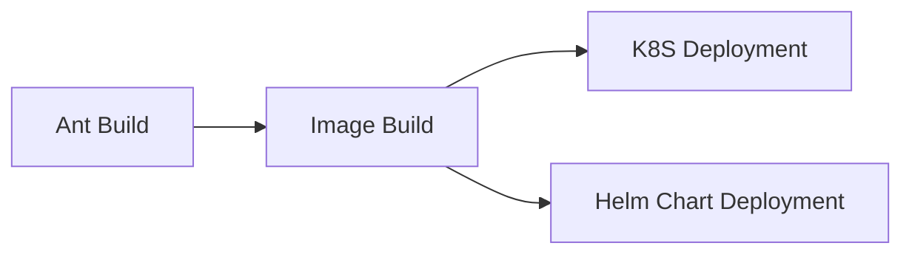
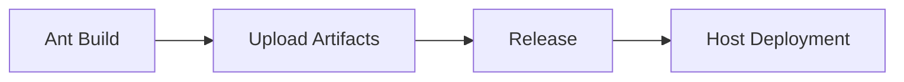
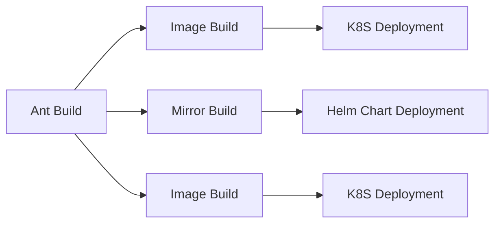

## Знакомство с формой

- **Версия JDK**: Выберите подходящую версию JDK из выпадающего списка. Плагин инициализирует среду JDK на основе выбранной версии.

- **Версия Ant**: Выберите соответствующую версию Ant из выпадающего списка. При выполнении плагин инициализирует окружение Ant на основе выбранной версии.

- **Команда сборки**: Команда сборки - это пользовательская команда для сборки кода. Команда выполняется по корневому пути репозитория кода и поддерживает ${Parameter Key} для получения переменных окружения. Обратите внимание, что добавление `set -e` может управлять автоматическим завершением команд скрипта в случае ошибок.

```shell
# Сборка на основе build.xml
ant -f build.xml
```

- **Артефакты сборки в корзине**:
- **Unique Identifier**: Идентификатор созданного артефакта, на который можно ссылаться в последующих задачах, используя `${Unique Identifier}` для получения артефакта.
    - **Упакованные файлы/каталоги**: Выберите файлы или каталоги, созданные артефактом, их может быть один или несколько (эти упаковочные каталоги сжимаются вместе).

- **Кэш сборки**:

> Параметр кэша поддерживает как абсолютные, так и относительные пути, например:

- xxx/xxx относительно корневого каталога хранилища кода
- /root/workspace/xxx

> Объяснение правила:

- Так называемый кэш по сути означает хранение модулей, которые неоднократно используются в нашем конвейере, в загруженном S3. Когда конвейер запускается снова, файл кэша загружается и извлекается из S3.
Только после успешной сборки конвейера обновленные файлы кэша будут загружены.
- Срок действия файлов кэша по умолчанию истекает через 30 дней.
- При каждом запуске конвейера срок действия кэша может быть продлен (даже если сборка не удалась)

## Примечания:

### Отсутствует плагин (пользователи интрасети)

Загрузите плагин в каталог ${ANT_HOME}/lib/ в разделе "Команды пользователя".

```shell
curl -o ${ANT_HOME}/lib/jdtCompilerAdapter.jar  http://xxxx/jdtCompilerAdapter.jar
curl -o ${ANT_HOME}/lib/rg.eclipse.jdt.core_3.7.3.v20120119-1537.jar  http://xxxx/rg.eclipse.jdt.core_3.7.3.v20120119-1537.jar
```

## Общие комбинации:

### Сборка и развертывание образа (один артефакт)



### Загрузка и развертывание артефактов (один артефакт)



### Сборка и развертывание образов (несколько артефактов)


  